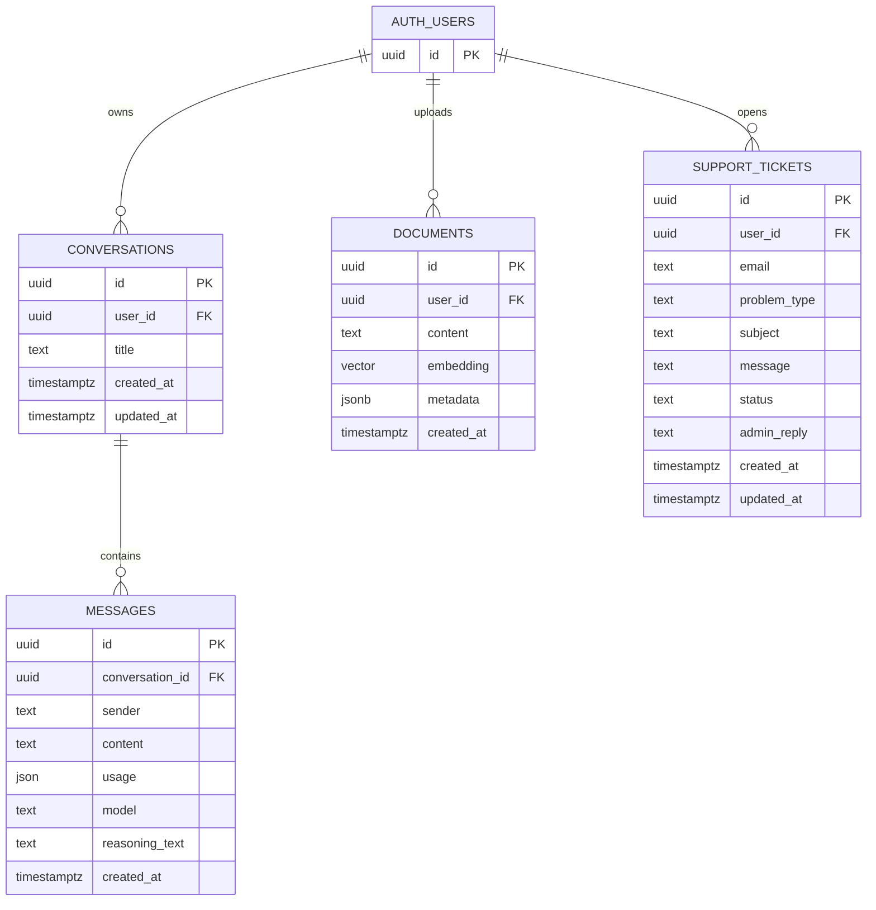

<div align="center">

# 🧠 Smart AI

**A full-stack AI-powered chat and document intelligence platform.**

Built with React, Express, and the Vercel AI SDK — connecting to multiple LLM providers through OpenRouter.

[](#)
[](#)
[](#)
[](./LICENSE)

</div>

---

## 📖 Overview

**Smart AI** is a modern, full-stack web application that provides an AI chat interface with multi-model support, real-time streaming responses, PDF document ingestion with semantic search (RAG), and user authentication — all wrapped in a clean, responsive UI with dark/light theme support.

This project was developed as a **Maturità capstone project** *(Progetto di Maturità)* by **Tommaso Paparesta**.

---

## 🎯 What this project does

At a practical level, Smart AI is designed to solve two main problems:

1. **General AI assistant usage** — users can chat with multiple LLMs from one interface, with streaming responses and saved conversations.
2. **Document-grounded answers (RAG)** — users can upload a PDF and ask questions about it; answers are generated using retrieved document chunks instead of relying only on model memory.

This means the app is useful both as:
- a daily multi-model AI chat client, and
- a study/work assistant that can explain and query your own documents with traceable context.

---

## ✨ Features

| Feature | Description |
|---|---|
| 💬 **Multi-Model AI Chat** | Converse with AI using models from Google, OpenAI, Anthropic, Meta, Nvidia, Deepseek, Qwen, and xAI — all through OpenRouter |
| ⚡ **Real-Time Streaming** | Token-by-token streaming output for a smooth, responsive chat experience |
| 📄 **PDF Document Intelligence (RAG)** | Upload PDFs, automatically chunk and embed them, and ask questions grounded in your documents |
| 🧩 **Structured Output** | Generate flashcards and quizzes with structured AI outputs using Zod schemas |
| 🔐 **Authentication** | Secure email/password sign-up and sign-in powered by Supabase Auth |
| 🎨 **Dark / Light Theme** | Full theme support across the entire application |
| 💾 **Conversation Persistence** | Conversations are saved and can be resumed at any time |
| 🛡️ **Protected Routes** | Route guards ensuring authenticated access to the application |
| ⚙️ **Custom System Prompts** | Personalize AI behavior with custom instructions, tone, and personal info |
| 📊 **Performance Metrics** | Latency and throughput metrics reported for every completion |

---

## 🏗️ Architecture

The project follows a **monorepo** structure with two main workspaces:

```
progetto-maturita/
├── client/                  # React frontend (Vite + TypeScript)
│   ├── src/
│   ���   ├── components/      # Reusable UI components
│   │   │   ├── Sidebar.tsx
│   │   │   ├── Textbar.tsx
│   │   │   ├── PromptStarter.tsx
│   │   │   ├── ProtectedRoute.tsx
│   │   │   └── other/       # BotMessage, UserMessage, BotLoading, etc.
│   │   ├── context/         # React context providers (Auth, App, Chat, Document)
│   │   ├── layouts/         # App layout shells (AppLayout, DocumentLayout)
│   │   ├── library/         # Utilities (Markdown renderer, Supabase client, system prompt)
│   │   ├── pages/           # Route-level page components
│   │   │   ├── LandingPage.tsx
│   │   │   ├── LoginPage.tsx
│   │   │   ├── ChatPage.tsx
│   │   │   ├── CompleteProfilePage.tsx
│   │   │   ├── DocumentPage.tsx
│   │   │   └── DocumentWizard/
│   │   ├── services/        # Supabase service layer
│   │   └── assets/          # Static assets
│   └── package.json
│
├── server/                  # Express backend (TypeScript)
│   ├── server.ts            # Main server entry point with all API routes
│   ├── static/              # Static files and system prompt
│   └── package.json
│
└── package.json             # Root workspace with concurrently scripts
```

---

## 🛠️ Tech Stack

### Frontend

| Technology | Purpose |
|---|---|
| [React 19](https://react.dev/) | UI framework |
| [TypeScript](https://www.typescriptlang.org/) | Type safety |
| [Vite 7](https://vite.dev/) | Build tool and dev server |
| [Tailwind CSS 4](https://tailwindcss.com/) | Utility-first styling |
| [React Router 7](https://reactrouter.com/) | Client-side routing |
| [Framer Motion](https://www.framer.com/motion/) | Animations |
| [Marked](https://marked.js.org/) + [Shiki](https://shiki.style/) + [KaTeX](https://katex.org/) | Markdown, code highlighting, and LaTeX rendering |
| [DOMPurify](https://github.com/cure53/DOMPurify) | HTML sanitization |
| [Lucide](https://lucide.dev/) + [Phosphor Icons](https://phosphoricons.com/) | Iconography |

### Backend

| Technology | Purpose |
|---|---|
| [Express 5](https://expressjs.com/) | HTTP server and API framework |
| [Vercel AI SDK](https://sdk.vercel.ai/) | Unified interface for LLM providers |
| [OpenRouter](https://openrouter.ai/) | Multi-model LLM gateway |
| [Google AI SDK](https://ai.google.dev/) | Direct Google Gemini access |
| [Supabase](https://supabase.com/) | Database, vector store, and authentication |
| [Multer](https://github.com/expressjs/multer) | File upload handling |
| [pdf-parse](https://www.npmjs.com/package/pdf-parse) | PDF text extraction |
| [Zod](https://zod.dev/) | Schema validation for structured outputs |

---

## 🚀 Getting Started

### Prerequisites

- [Node.js](https://nodejs.org/) **v18+**
- [npm](https://www.npmjs.com/) **v9+**
- A [Supabase](https://supabase.com/) project (for auth, database, and vector store)
- An [OpenRouter](https://openrouter.ai/) API key

### Installation

1. **Clone the repository**

   ```bash
   git clone https://github.com/paparesta-007/progetto-maturita.git
   cd progetto-maturita
   ```

2. **Install dependencies**

   ```bash
   # Root dependencies (concurrently)
   npm install

   # Client dependencies
   cd client && npm install && cd ..

   # Server dependencies
   cd server && npm install && cd ..
   ```

3. **Configure environment variables**

   Create a `.env` file inside the `server/` directory:

   ```env
   VITE_OPENROUTER_API_KEY=your_openrouter_api_key
   SUPABASE_URL=your_supabase_project_url
   SUPABASE_SERVICE_KEY=your_supabase_service_role_key
   GOOGLE_GENERATIVE_AI_API_KEY=your_google_ai_api_key  # Optional, for direct Gemini access
   ```

4. **Set up Supabase**

   - Create a `documents` table to store document chunks and embeddings.
   - Create an RPC function `match_documents` for vector similarity search.
   - Enable Supabase Auth with email/password sign-in.

### Running the Application

```bash
# Start both client and server concurrently
npm run dev
```

This launches:
- **Client** → `http://localhost:5173` (Vite dev server)
- **Server** → `http://localhost:3000` (Express API)

You can also start them individually:

```bash
npm run client   # Frontend only
npm run server   # Backend only
```

---

## 🗺️ Entity-Relationship Map (Mermaid)

The backend uses Supabase with the following core entities and relationships:



> Note: `documents` stores embedded text chunks. In `metadata` (JSONB), the backend saves fields such as `document_id`, `source`, `title`, `category`, `order`, and optional `sectionHeading`.

---

## 🔌 Complete Server Routes Table

All routes currently defined in `server/server.ts`:

| Method | Route | Purpose |
|---|---|---|
| `POST` | `/api/completion/chat` | Non-streaming chat completion (OpenRouter) with metrics |
| `POST` | `/api/gemini/getTitleConversation` | Generate a short conversation title |
| `POST` | `/api/getSuggestedQuestion` | Generate suggested follow-up questions |
| `POST` | `/api/streamingOutput` | Streaming chat completion endpoint |
| `POST` | `/api/documents/ingest` | Upload PDF, chunk text, embed, and store in Supabase |
| `POST` | `/api/conversations/create` | Create a conversation |
| `POST` | `/api/conversations/messages/create` | Create a message in a conversation |
| `GET` | `/api/conversations/list` | List conversations for a user |
| `GET` | `/api/conversations/messages` | List messages of a conversation |
| `DELETE` | `/api/conversations/delete` | Delete a conversation |
| `PATCH` | `/api/conversations/update-title` | Update conversation title |
| `POST` | `/api/chat/ask-pdf` | Ask questions over ingested PDF chunks (RAG) |
| `POST` | `/api/quiz/generate` | Generate a 10-question quiz from a topic/text |
| `POST` | `/api/support/getUserTickets` | Retrieve support tickets for a user |
| `POST` | `/api/support/submit` | Submit a support ticket |
| `GET` | `/logs` | Serve log viewer page (`static/log.html`) |
| `POST` | `/logs` | Receive and store frontend/client logs |
| `GET` | `/api/client-logs` | Return in-memory client logs |
| `GET` | `/api/logs` | Return in-memory server audit logs |
| `DELETE` | `/api/logs` | Clear in-memory server + client logs |

---

## 📚 How RAG Works

The document intelligence pipeline follows a classic **Retrieval-Augmented Generation** pattern:

```
┌──────────┐    ┌──────────┐    ┌───────────┐    ┌──────────┐    ┌──────────┐
│  Upload   │ →  │  Parse   │ →  │  Chunk    │ →  │  Embed   │ →  │  Store   │
│   PDF     │    │  Text    │    │  (1000c)  │    │  (OpenAI │    │ Supabase │
│           │    │          │    │  overlap  │    │  embed)  │    │ pgvector │
└──────────┘    └──────────┘    └───────────┘    └──────────┘    └──────────┘

                              ┌──────────┐
                              │  Query   │
                              └────┬─────┘
                                   ↓
                    ┌──────────────────────────────┐
                    │  Embed query → Cosine search │
                    │  → Retrieve top-k chunks     │
                    │  → Generate grounded answer  │
                    └──────────────────────────────┘
```

### Step-by-step flow used in this project

1. **Upload & validation**
   - The client uploads a PDF through `/api/documents/ingest`.
   - The server validates file presence and user context before processing.

2. **Text extraction**
   - PDF text is extracted server-side using `pdf-parse`.
   - If parsing fails (corrupted/invalid PDF), ingestion stops with an explicit error response.

3. **Text normalization**
   - Raw text is cleaned (`normalizeText`) to remove control characters, normalize line breaks, and improve chunk quality.

4. **Semantic chunking**
   - The backend runs `splitTextIntoChunks(text, 1500, 300, ...)`:
     - chunk size ≈ 1500 chars
     - overlap ≈ 300 chars
     - paragraph/sentence-aware splitting
   - It also detects likely section titles and stores them as metadata (`sectionHeading`).
   - `validateChunks` is used to check chunk continuity.

5. **Embedding generation**
   - Each chunk is embedded with `openai/text-embedding-3-small` (via OpenRouter embeddings API).
   - Chunk text is enriched with source metadata before vectorization.

6. **Vector storage**
   - Chunk + embedding + metadata are saved in Supabase (`documents` table with pgvector).
   - Metadata includes source filename, title/category, and document UUID.

7. **Question-time retrieval**
   - For `/api/chat/ask-pdf`, the user question is embedded with the same embedding model.
   - Supabase RPC `match_documents` performs similarity search (cosine-based vector match) with threshold + top-k style filtering.
   - The API returns the most relevant chunks for that user/document scope.

8. **Grounded answer generation**
   - Retrieved chunks are assembled into a structured context block.
   - The LLM receives: user question + retrieved context + system guidance.
   - Final answer is streamed back to the client with references/sources to keep responses grounded in uploaded content.

### Why this RAG flow is effective

- **Reduces hallucinations** by grounding generation on retrieved chunks.
- **Improves relevance** by searching semantically similar text instead of exact keyword matching.
- **Keeps answers explainable** through source-aware context construction.
- **Scales better** than putting an entire long document directly in the model prompt.

---

## 📚 Inspiration and sources for the RAG approach

The implementation follows standard RAG architecture patterns commonly described in:

- **Lewis et al., 2020 — Retrieval-Augmented Generation for Knowledge-Intensive NLP Tasks**  
  https://arxiv.org/abs/2005.11401
- **OpenAI Cookbook — Question Answering using embeddings / vector search patterns**  
  https://cookbook.openai.com/
- **Supabase documentation — pgvector and similarity search in Postgres**  
  https://supabase.com/docs/guides/ai
- **General RAG architecture best practices** from modern AI engineering documentation and community references (chunking, overlap, embedding + retrieval + generation pipeline).

In short, the project adapts these well-known patterns to a practical, full-stack app context: PDF ingestion, semantic indexing, and grounded Q&A inside a single product.

---

## 🎨 Screenshots

> *Coming soon — contributions welcome!*

---

## 📄 License

This project is licensed under the **GNU General Public License v3.0** — see the [LICENSE](./LICENSE) file for details.

---

## 👤 Author

**Tommaso Paparesta**

- GitHub: [@paparesta-007](https://github.com/paparesta-007)

---

<div align="center">

*Built with ❤️ as a Maturità capstone project*

</div>
