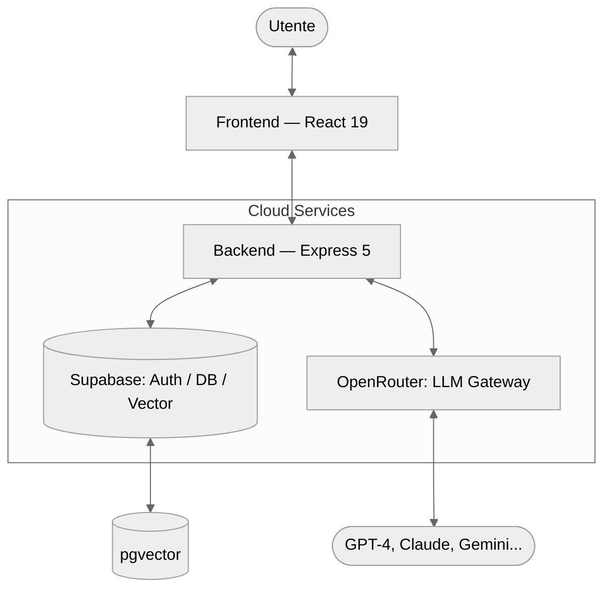

# 02 - Architettura Generale

L'architettura di **SmartAI** è stata progettata seguendo i principi di modularità, scalabilità e separazione delle responsabilità (*Separation of Concerns*). Il sistema si basa su un modello **Client-Server** moderno, organizzato in una struttura **Monorepo** — un singolo repository che ospita più progetti distinti — che consente una gestione centralizzata dell'intero ciclo di vita del software.

---

## 2.1 Macro-Architettura Monorepo

Il progetto adotta una struttura Monorepo coordinata tramite **npm workspaces**, che permette di mantenere frontend e backend in un unico repository pur conservando la loro indipendenza operativa.

### Struttura delle Cartelle

- **`/client`**: Applicazione Single Page Application (SPA) costruita con React 19.
- **`/server`**: API Gateway e motore di orchestrazione in Node.js con Express 5.
- **`/docs`**: Documentazione tecnica completa, inclusa questa tesina.

### Schema della Codebase

```text
smart-ai/
├── client/                  # Frontend React 19
│   └── src/
│       ├── components/      # Componenti UI atomici e riutilizzabili
│       ├── context/         # Gestione dello stato globale
│       ├── pages/           # Viste principali dell'applicazione
│       ├── services/        # Client per le chiamate API
│       └── library/         # Componenti per la Generative UI
├── server/                  # Backend Express 5
│   ├── server.ts            # Entry point dell'applicazione
│   ├── routes/              # Definizione degli endpoint API
│   ├── services/            # Logica di business, AI e RAG
│   ├── middleware/          # Gestione auth, log e audit
│   └── utils/               # Helper e funzioni di utilità
└── docs/                    # Documentazione tecnica e tesina
```

### Gestione dei Processi in Sviluppo

Per lo sviluppo locale viene utilizzata la libreria `concurrently`, che consente di avviare simultaneamente il server Vite (frontend) e il processo TSX (backend) con un unico comando, centralizzando tutti i log in un'unica console.

---

## 2.2 Frontend: L'Interfaccia Intelligente (React 19)

Il client è costruito su **React 19**, sfruttando le ultime ottimizzazioni nel rendering. La gestione dello stato globale è affidata alla **Context API**, organizzata in provider specializzati:

- **`AuthContext`**: Gestisce lo stato della sessione e l'integrazione con Supabase Auth.
- **`AppContext`**: Coordina le impostazioni globali dell'applicazione.
- **`SchemaContext` & `CalendarContext`**: Gestiscono gli stati complessi delle funzionalità verticali, rispettivamente le mappe concettuali e il calendario.

### Routing e Protezione delle Rotte

La navigazione è gestita da `react-router-dom` (v6), con una struttura di rotte nidificate:

1. **Rotte Pubbliche**: Landing page, Help, Knowledge base — accessibili da chiunque.
2. **Rotte Protette**: Accessibili solo previa autenticazione. Un componente `ProtectedRoute` verifica la validità del JWT rilasciato da Supabase prima di consentire l'accesso, garantendo la sicurezza dei dati sensibili.

---

## 2.3 Backend: Il Motore di Orchestrazione (Express 5)

Il server funge da **API Gateway** e orchestratore dei servizi AI. L'adozione di **Express 5** garantisce una gestione nativa e più fluida delle rotte asincrone basate su Promise. La persistenza è delegata a **Supabase**, una piattaforma BaaS (*Backend as a Service*) che fornisce database PostgreSQL, autenticazione, storage e API in tempo reale.

### Middleware Stack

Ogni richiesta in ingresso attraversa una pipeline di middleware nell'ordine seguente:

1. **CORS & JSON Parsing**: Configurazione della sicurezza cross-origin e limite del body a 10 MB.
2. **HTTP Logging**: Ogni chiamata viene registrata nel sistema di audit con metodo, percorso, IP e tempo di risposta.
3. **Auth Middleware**: Verifica la validità del token Supabase prima di inoltrare la richiesta alle rotte private.

### Pipeline AI e Streaming

A differenza delle API tradizionali, SmartAI implementa lo **streaming NDJSON**. Quando l'utente invia un messaggio, il server non attende la risposta completa dell'LLM, ma apre un canale di streaming diretto verso il client. Questo approccio riduce drasticamente la latenza percepita, misurata come *Time To First Token (TTFT)*.

---

## 2.4 Persistenza e Integrazioni Esterne

La persistenza e l'intelligenza del sistema sono delegate a due infrastrutture esterne:

1. **Supabase (Ecosistema PostgreSQL)**:
   - **Vector Store**: L'estensione `pgvector` memorizza gli embeddings dei documenti e abilita la ricerca semantica per il sistema RAG.
   - **Database Relazionale**: Gestione di utenti, conversazioni, messaggi e metadati applicativi.

2. **OpenRouter (AI Gateway)**:
   - Funziona come strato di astrazione sopra decine di modelli (OpenAI, Anthropic, Google, Meta e altri).
   - Permette di cambiare il modello in uso dinamicamente, senza modificare il codice del server.

---

## 2.5 Diagrammi Architetturali

### Architettura di Sistema



---

## 2.6 Sicurezza e Gestione dei Log

Un componente critico dell'architettura è il sistema di **Unified Audit Log**, che centralizza tre tipologie di informazioni:

1. **Log di Sistema**: Avvio del server ed errori critici.
2. **Log HTTP**: Tracciamento di ogni richiesta in entrata (metodo, path, IP, tempo di risposta).
3. **Log del Client**: Errori JavaScript generati nel browser dell'utente, trasmessi al server tramite l'endpoint `/logs`.

Questa struttura garantisce che ogni malfunzionamento sia tracciabile, rendendo la piattaforma robusta e pronta per un utilizzo in produzione.

---

## 2.7 Appendice: Dipendenze del Progetto

### Frontend (Client)
- **React 19 & Vite**: Core engine e tool di build.
- **Supabase JS**: Integrazione con database e autenticazione.
- **Framer Motion**: Animazioni e micro-interazioni fluide.
- **Lucide React & Phosphor Icons**: Set di icone vettoriali.
- **Marked & KaTeX**: Rendering di Markdown e formule matematiche.
- **Zod**: Validazione degli schemi dati a runtime.

### Backend (Server)
- **Express 5**: Framework web per Node.js.
- **Vercel AI SDK & OpenRouter**: Orchestrazione multi-modello.
- **Supabase JS**: Gestione lato server dei dati e integrazione con `pgvector`.
- **Multer & Express Fileupload**: Gestione dell'upload di file PDF.
- **PDF-parse**: Estrazione del testo dai documenti per il sistema RAG.
- **TSX**: Esecuzione nativa di TypeScript in ambiente Node.js.