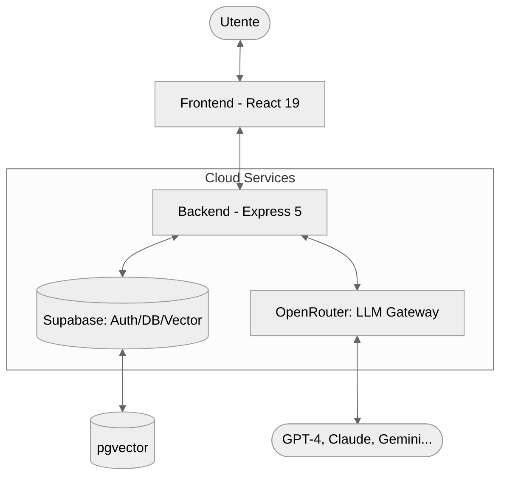
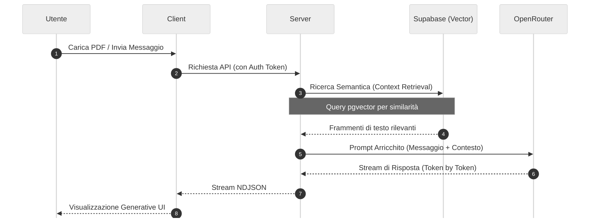

# 02 - Architettura Generale

L'architettura di **Smart AI** è stata progettata seguendo i principi di modularità, scalabilità e separazione delle responsabilità (*Separation of Concerns*). Il sistema si basa su un modello **Client-Server** moderno, orchestrato in una struttura **Monorepo** che permette una gestione fluida del ciclo di vita del software.

---

## Macro-Architettura Monorepo

Il progetto adotta una struttura Monorepo gestita tramite **npm workspaces** (o script coordinati), che permette di mantenere frontend e backend in un unico repository pur conservando la loro indipendenza operativa.

### Struttura delle Cartelle
- **`/client`**: Applicazione Single Page Application (SPA) in React 19.
- **`/server`**: API Gateway e motore di orchestrazione in Node.js (Express 5).
- **`/docs`**: Documentazione tecnica completa (inclusa questa tesina).

### Schema Strutturale della Codebase

```text
smart-ai/
├── client/ (Frontend React 19)
│   └── src/
│       ├── components/  # UI Atomica e riutilizzabile
│       ├── context/     # Gestione dello stato globale
│       ├── pages/       # Viste principali dell'applicazione
│       ├── services/    # Client per chiamate API
│       └── library/     # Componenti per la Generative UI
├── server/ (Backend Express 5)
│   ├── server.ts        # Entry point dell'applicazione
│   ├── routes/          # Definizione degli endpoint API
│   ├── services/        # Logica di business, AI e RAG
│   ├── middleware/      # Gestione Auth, Log e Audit
│   └── utils/           # Helper e funzioni di utilità
└── docs/                # Documentazione tecnica e tesina
```

### Gestione dei Processi
Per lo sviluppo locale, viene utilizzata la libreria `concurrently`, che permette di avviare simultaneamente il server di sviluppo di Vite (frontend) e il processo TSX (backend) con un unico comando, centralizzando i log in un'unica console.

---

## Frontend: L'Interfaccia Intelligente (React 19)

Il frontend non è una semplice interfaccia di visualizzazione, ma un'applicazione reattiva capace di gestire flussi di dati in streaming e componenti dinamici.

### Core e State Management
L'architettura del client si basa su **React 19**, sfruttando le ultime ottimizzazioni nel rendering. La gestione dello stato globale è affidata alla **Context API**, strutturata in diversi provider specializzati:
- **`AuthContext`**: Gestisce lo stato della sessione e l'integrazione con Supabase Auth.
- **`AppContext`**: Coordina le impostazioni globali dell'applicazione.
- **`SchemaContext` & `CalendarContext`**: Gestiscono gli stati complessi delle funzionalità verticali (mappe concettuali e calendario).

### Routing e Protezione
Utilizziamo `react-router-dom` (v6) per gestire una struttura di rotte nidificate:
1.  **Rotte Pubbliche**: Landing page, Help, Knowledge base.
2.  **Rotte Protette**: Accessibili solo tramite autenticazione, avvolte in un componente `ProtectedRoute` che verifica il JWT di Supabase.

> [!IMPORTANT]
> **Remote Logging**: Il frontend include un sistema di `initRemoteLogger()` che intercetta gli errori di runtime e li invia automaticamente al backend per un debug centralizzato.

---

## Backend: Il Motore di Orchestrazione (Express 5)

Il server agisce come un **API Gateway** e orchestratore di servizi AI. L'uso di **Express 5** garantisce una gestione nativa e più fluida delle rotte asincrone (Promise).

### Middleware Stack
Il flusso di ogni richiesta passa attraverso una pipeline di middleware:
1.  **CORS & JSON Parsing**: Configurazione della sicurezza e limite del body a 10MB.
2.  **HTTP Logging**: Ogni chiamata viene registrata nel sistema di audit.
3.  **Auth Middleware**: Verifica la validità del token Supabase prima di procedere alle rotte private.

### Pipeline AI e Streaming
A differenza delle API tradizionali, Smart AI implementa lo **streaming NDJSON**. Quando l'utente invia un messaggio, il server non attende la risposta completa dall'LLM, ma apre un canale di streaming verso il client, riducendo drasticamente la latenza percepita (*Time To First Token*).

---

## Persistenza e Integrazioni Esterne

Il sistema delega la persistenza e l'intelligenza a due partner infrastrutturali leader:

1.  **Supabase (PostgreSQL Ecosystem)**:
    *   **Vector Store**: Utilizziamo l'estensione `pgvector` per memorizzare gli embeddings dei documenti e permettere la ricerca semantica (RAG).
    *   **Database Relazionale**: Gestione di utenti, conversazioni, messaggi e metadati.
2.  **OpenRouter (AI Gateway)**:
    *   Agisce come strato di astrazione sopra decine di modelli (OpenAI, Anthropic, Google, Meta).
    *   Permette lo switching dinamico del modello senza cambiare il codice del server.

---

## Diagrammi Architetturali

### 1. Architettura di Sistema



### 2. Flusso Dati Richiesta AI (RAG)



---

## Sicurezza e Gestione dei Log

Un aspetto critico dell'architettura è il **Unified Audit Log**. Il sistema centralizza tre tipi di informazioni:
1.  **Log di Sistema**: Avvio del server, errori critici.
2.  **Log HTTP**: Tracciamento di ogni richiesta (metodo, path, IP, tempo di risposta).
3.  **Log del Client**: Errori JavaScript che avvengono nel browser dell'utente, inviati tramite l'endpoint `/logs`.

Questa architettura garantisce che ogni malfunzionamento sia tracciabile, rendendo la piattaforma robusta e pronta per un utilizzo reale.

---

## Appendice: Dipendenze del Progetto

Il progetto utilizza un ecosistema di librerie moderne per garantire performance e facilità di sviluppo.

### Frontend (Client)
- **React 19 & Vite**: Core engine e tool di build.
- **Supabase JS**: Integrazione con database e autenticazione.
- **Framer Motion**: Animazioni premium e micro-interazioni.
- **Lucide React & Phosphor Icons**: Set di icone vettoriali.
- **Marked & Katex**: Rendering di Markdown e formule matematiche.
- **Three.js & React Three Fiber**: Supporto per visualizzazioni 3D avanzate.
- **Zod**: Validazione degli schemi dati.

### Backend (Server)
- **Express 5**: Framework web per Node.js.
- **Vercel AI SDK & OpenRouter**: Orchestrazione multi-modello.
- **Supabase JS**: Gestione lato server dei dati e pgvector.
- **Multer & Express Fileupload**: Gestione dell'upload di file PDF.
- **PDF-parse**: Estrazione di testo dai documenti per il RAG.
- **TSX**: Esecuzione nativa di TypeScript in ambiente Node.

