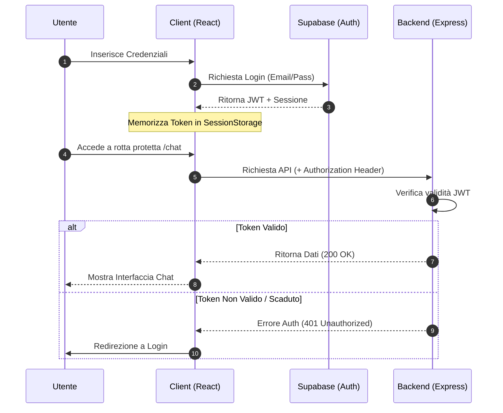

# 03 - Autenticazione

Il sistema di autenticazione di **Smart AI** è basato su **Supabase Auth**, una soluzione robusta che gestisce l'intero ciclo di vita dell'utente, dalla registrazione alla gestione delle sessioni sicure tramite JWT (JSON Web Tokens).

---

## Funzionamento del Sistema

L'autenticazione segue un approccio moderno e decentralizzato:
1.  **Gestione Sessione**: Al momento del login, Supabase rilascia un JWT che viene memorizzato in modo sicuro nel browser dell'utente.
2.  **Protezione Frontend**: Le rotte sensibili dell'applicazione (Chat, Calendario, Documenti) sono avvolte in un componente `ProtectedRoute` che reindirizza gli utenti non autenticati alla pagina di login.
3.  **Autorizzazione API**: Ogni richiesta inviata al backend include il token JWT nell'header `Authorization`. Il server verifica la validità del token prima di elaborare la richiesta.
4.  **Social Login & Provider**: Il sistema supporta l'accesso tramite **Google** e **GitHub**. Grazie alla configurazione di Supabase, se un utente accede con diversi provider utilizzando la stessa email, gli account vengono automaticamente collegati, evitando la creazione di duplicati e garantendo l'accesso ai medesimi dati.

---

## Focus: Cos'è un JWT?

Per capire meglio come funziona la sicurezza dietro le quinte, possiamo immaginare il **JWT (JSON Web Token)** come un **braccialetto elettronico** che ricevi all'ingresso di un club o di un festival:

1.  **Il Check-in**: Quando fai il login, il sistema verifica chi sei e ti consegna questo "braccialetto" digitale.
2.  **Accesso Senza Domande**: Da quel momento in poi, ogni volta che chiedi di vedere i tuoi messaggi o i tuoi documenti, non devi ripetere email e password. Ti basta mostrare il braccialetto (il token) e il server ti lascia passare immediatamente.
3.  **Sicurezza Garantita**: Il braccialetto è firmato digitalmente. Se qualcuno provasse a modificarlo (ad esempio per fingere di essere un altro utente), la firma risulterebbe alterata e il sistema lo rifiuterebbe all'istante.

Questo metodo rende l'applicazione **estremamente veloce** e **sicura**, perché il server sa chi sei semplicemente guardando il token, senza dover andare a cercare ogni volta i tuoi dati nel database principale.

---

## Interfaccia di Accesso

Di seguito è rappresentata la struttura della pagina di login dell'applicazione:

```text
+-----------------------------------------------------------+
|                                                           |
|                     [ IMMAGINE ]                          |
|             (Rappresentazione Pagina Login)               |
|                                                           |
|       +-------------------------------------------+       |
|       |                                           |       |
|       |             Accedi a Smart AI             |       |
|       |                                           |       |
|       |  Email: [_____________________________]   |       |
|       |  Password: [**************************]   |       |
|       |                                           |       |
|       |             [ BOTTONE ACCEDI ]            |       |
|       |                                           |       |
|       |     ----------- oppure -----------        |       |
|       |                                           |       |
|       |     [ G ] Accedi con Google               |       |
|       |     [ git ] Accedi con GitHub             |       |
|       |                                           |       |
|       +-------------------------------------------+       |
|                                                           |
+-----------------------------------------------------------+
```

---

## Flusso di Autenticazione (UML)

Il seguente schema descrive l'interazione tra l'utente, il client, Supabase e il server durante il processo di autenticazione e accesso ai dati protetti.



