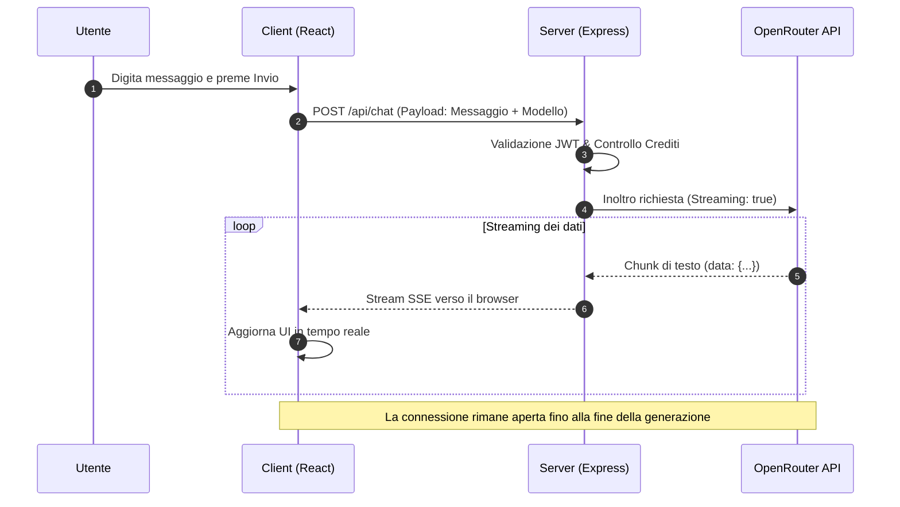

# 04 - Chat Multi Modello

Il modulo di **Chat Multi Modello** rappresenta il cuore operativo di **Smart AI**. A differenza delle interfacce tradizionali legate a un singolo provider, questa implementazione permette di interagire con decine di modelli diversi (OpenAI, Anthropic, Google Gemini, Meta Llama) attraverso un'unica interfaccia agnostica.

---

## Architettura della Chat

L'architettura segue un modello a "Gateway" per garantire sicurezza e flessibilità:

1.  **Frontend (React)**: Gestisce lo stato della conversazione, il rendering del Markdown e la selezione dinamica del modello.
2.  **Backend (Express)**: Funge da intermediario sicuro (Proxy). Invece di esporre le chiavi API sul client, il server riceve la richiesta, valida l'autenticazione dell'utente e inoltra la chiamata ai provider.
3.  **OpenRouter API**: Utilizzato come aggregatore universale. Questo ci permette di avere un'unica implementazione di codice per parlare con modelli che avrebbero altrimenti API diverse.

---

## Caratteristiche Tecniche

### 1. Risposta in Streaming (SSE)
Per migliorare la *User Experience*, la chat utilizza i **Server-Sent Events (SSE)**. Invece di attendere che l'IA generi l'intera risposta (che potrebbe richiedere diversi secondi), il testo viene visualizzato parola per parola man mano che viene generato.

### 2. Selezione Dinamica del Modello
Grazie a un servizio di recupero metadati (`getModels`), l'utente può scegliere il modello più adatto al compito:
- **Modelli Veloci**: Per correzioni grammaticali o risposte rapide (es. GPT-4o-mini).
- **Modelli Potenti**: Per programmazione o analisi complessa (es. Claude 3.5 Sonnet).
- **Modelli di Ragionamento**: Per problemi logico-matematici (es. o1-preview).

### 3. Gestione del Reasoning Effort
Per i modelli di nuova generazione che supportano il "ragionamento interno", il sistema permette di configurare il `reasoning_effort`. Questo parametro indica all'IA quanto tempo "pensare" prima di rispondere, ottimizzando il bilanciamento tra precisione e velocità.

---

## Flusso di Comunicazione (UML)

Il diagramma seguente illustra il viaggio di un messaggio, dalla digitazione dell'utente fino alla ricezione dei dati in streaming.

---

## Vantaggi dell'Approccio Agnostico

*   **Ridondanza**: Se un provider (es. OpenAI) è offline, l'utente può passare istantaneamente a un altro (es. Anthropic).
*   **Costi Ottimizzati**: Possibilità di scegliere modelli più economici per task semplici.
*   **Futuribilità**: L'aggiunta di un nuovo modello rilasciato sul mercato richiede zero modifiche al codice del frontend.
