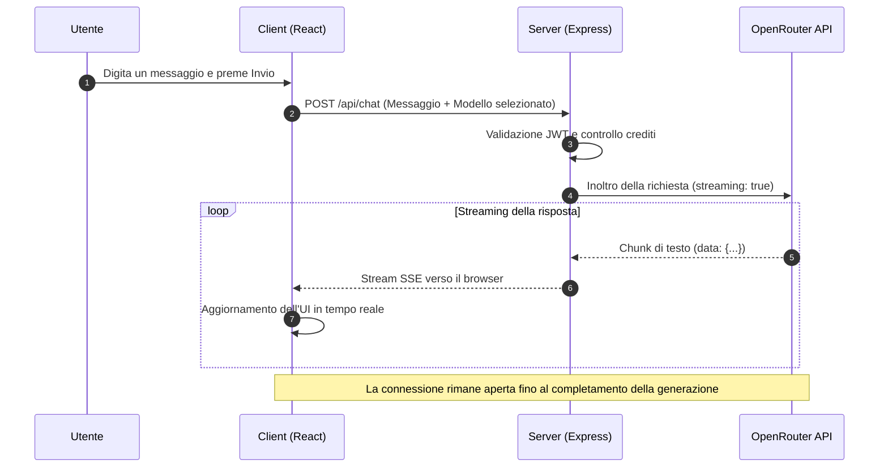

# 04 - Chat e Interazione con LLM

Il modulo di chat consente di interagire con decine di modelli diversi — OpenAI, Anthropic, Google Gemini, Meta Llama — attraverso un'unica interfaccia unificata: **OpenRouter**.

---

## 4.1 Architettura della Chat

Il sistema è strutturato secondo un modello a **Gateway**, pensato per garantire sicurezza e flessibilità:

1. **Frontend (React)**: Gestisce lo stato della conversazione, il rendering del Markdown e la selezione dinamica del modello da parte dell'utente.
2. **Backend (Express)**: Agisce da intermediario sicuro (proxy). Le chiavi API non vengono mai esposte al client: il server riceve la richiesta, verifica l'autenticazione e inoltra la chiamata ai provider.
3. **OpenRouter**: Funziona da aggregatore universale, offrendo un'unica implementazione per parlare con modelli che avrebbero altrimenti API differenti tra loro.

---

## 4.2 Caratteristiche Tecniche

### 1. Risposta in Streaming (SSE)

Per migliorare l'esperienza utente, la chat sfrutta i **Server-Sent Events (SSE)**. Invece di attendere che il modello generi l'intera risposta — operazione che può richiedere diversi secondi — il testo viene visualizzato parola per parola nel momento stesso in cui viene prodotto, esattamente come si vede su ChatGPT o Claude.

### 2. Selezione Dinamica del Modello

Tramite un servizio di recupero metadati (`getModels`), l'utente può scegliere il modello più adatto al proprio compito:

- **Modelli Veloci**: Ideali per correzioni grammaticali o risposte rapide (es. GPT-5.5).
- **Modelli Potenti**: Ottimali per programmazione o analisi complessa (es. Claude Opus 4.7).
- **Modelli di Ragionamento**: Pensati per problemi logico-matematici (es. Gemini 3.1 Pro).

### 3. Gestione del Reasoning Effort

I modelli di nuova generazione supportano un meccanismo di "ragionamento interno" prima di rispondere. Il sistema espone il parametro `reasoning_effort`, che permette di regolare quanto tempo il modello dedica a "pensare" prima di produrre l'output, trovando il giusto equilibrio tra precisione e velocità di risposta.

---

## 4.3 Flusso di Comunicazione (UML)

Il diagramma illustra il percorso di un messaggio, dalla digitazione dell'utente fino alla ricezione della risposta in streaming.

---

## 4.4 Vantaggi dell'Approccio Centralizzato

- **Ridondanza**: Se un provider è temporaneamente non disponibile (es. OpenAI), l'utente può passare immediatamente a un altro (es. Anthropic), senza interruzioni.
- **Ottimizzazione dei Costi**: È possibile scegliere modelli più economici per task semplici, riservando quelli più potenti — e costosi — alle operazioni che lo richiedono davvero.
- **Facilità di Aggiornamento**: L'aggiunta di un nuovo modello sul mercato non richiede alcuna modifica al codice del frontend.