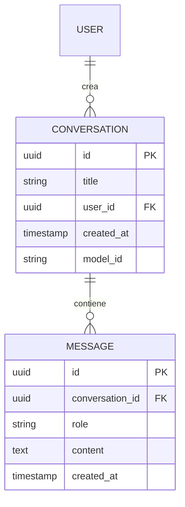

# 05 - Gestione Conversazioni e Persistenza

La capacità di un'intelligenza artificiale di "ricordare" i messaggi precedenti è fondamentale per una conversazione naturale. In **Smart AI**, questa funzionalità è gestita attraverso un sistema di persistenza basato su **Supabase (PostgreSQL)**, che permette all'utente di riprendere le proprie chat da qualsiasi dispositivo.

---

## Il Modello dei Dati

La struttura del database è progettata per gestire conversazioni multiple per ogni utente, mantenendo l'ordine cronologico dei messaggi.

### Entità Principali:
1.  **Conversations**: Contiene i metadati della chat (Titolo, ID Utente, Data di creazione, Modello AI preferito).
2.  **Messages**: Contiene i singoli scambi (Ruolo: "user" o "assistant", Contenuto, Timestamp, Riferimento alla conversazione).

---

## Funzionalità di Gestione (CRUD)

Il sistema implementa tutte le operazioni fondamentali per una gestione completa del ciclo di vita della chat:

*   **Creazione**: Al primo messaggio inviato, viene creata una nuova istanza di conversazione. Il titolo viene inizialmente impostato come "Nuova Chat" e successivamente aggiornato.
*   **Recupero (Listing)**: La sidebar dell'applicazione interroga il database per mostrare la cronologia delle chat dell'utente, ordinate per data.
*   **Aggiornamento Titolo**: L'utente può rinominare le conversazioni per organizzarle meglio. (In futuro è prevista la generazione automatica del titolo tramite IA basandosi sul contenuto).
*   **Eliminazione**: Permette di rimuovere una conversazione. Grazie ai vincoli di integrità referenziale (`ON DELETE CASCADE`), l'eliminazione di una conversazione rimuove automaticamente tutti i messaggi associati.

---

## Gestione del Contesto (Windowing)

Poiché i modelli di linguaggio hanno un limite di "token" (memoria a breve termine), il sistema non invia sempre l'intera storia della chat, ma adotta una strategia di **Sliding Window**:

1.  Vengono recuperati gli ultimi *N* messaggi dal database.
2.  I messaggi vengono formattati in un array di oggetti (JSON) comprensibile dall'IA.
3.  Viene aggiunto un "System Prompt" iniziale che definisce il comportamento dell'assistente.

Questa tecnica garantisce che l'IA abbia sempre i riferimenti più recenti della conversazione senza superare i limiti tecnici dei provider.

---

## Integrazione Frontend-Backend

Le chiamate al database avvengono tramite i servizi Supabase integrati nel client, garantendo tempi di risposta minimi grazie alle capacità di indicizzazione di PostgreSQL. Ogni volta che l'IA termina di generare una risposta (streaming completato), il contenuto finale viene salvato permanentemente nel database.
