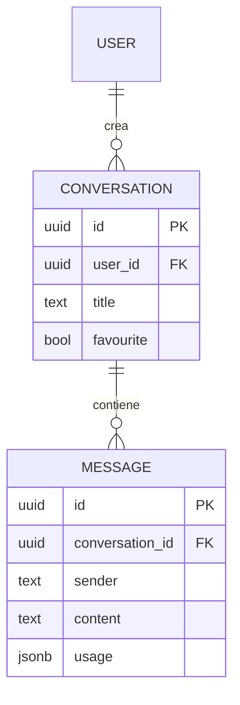

# 05 - Gestione della Persistenza

Perché una conversazione con un'IA sia utile, è fondamentale che il sistema ricordi i messaggi precedenti. In **SmartAI** questa funzionalità è gestita da un sistema di persistenza basato su **Supabase (PostgreSQL)**, che consente all'utente di riprendere le proprie chat da qualsiasi dispositivo in qualsiasi momento.

---

## 5.1 Il Modello dei Dati

La struttura del database è pensata per gestire conversazioni multiple per ogni utente, preservando l'ordine cronologico dei messaggi.

### Entità Principali

1. **Conversations**: Contiene i metadati della chat — titolo, ID utente, data di creazione e modello AI preferito.
2. **Messages**: Contiene i singoli scambi — ruolo (`user` o `assistant`), contenuto, timestamp e riferimento alla conversazione di appartenenza.

---

## 5.2 Operazioni CRUD sulla Chat

Il sistema implementa tutte le operazioni fondamentali per la gestione del ciclo di vita di una conversazione:

- **Creazione**: Al primo messaggio inviato, viene creata una nuova conversazione. Il titolo viene impostato inizialmente come "Nuova Chat" e potrà essere aggiornato in seguito.
- **Recupero (Listing)**: La sidebar interroga il database per mostrare la cronologia delle chat dell'utente, ordinate per data di creazione.
- **Rinomina**: L'utente può assegnare un nome personalizzato a ogni conversazione per organizzarle. In futuro è prevista la generazione automatica del titolo tramite IA, basata sul contenuto della chat.
- **Eliminazione**: La rimozione di una conversazione sfrutta il vincolo `ON DELETE CASCADE`, che cancella automaticamente tutti i messaggi associati, garantendo la coerenza dei dati.

---

## 5.3 Gestione del Contesto con la Sliding Window

I modelli di linguaggio hanno un limite nel numero di token che possono elaborare in una singola richiesta. Per questo motivo, il sistema non invia mai l'intera storia della conversazione, ma adotta una strategia di **Sliding Window**:

1. Vengono recuperati dal database solo gli ultimi *N* messaggi. Quelli più vecchi vengono compressi in un unico messaggio di riepilogo, in modo da mantenere il filo della conversazione senza sovraccaricare il modello.
2. I messaggi vengono formattati in un array JSON comprensibile dall'IA.
3. A ogni richiesta viene anteposto un **System Prompt** che definisce il comportamento e il tono dell'assistente.

Questa tecnica garantisce che il modello abbia sempre accesso ai riferimenti più recenti della conversazione, senza mai superare i limiti tecnici imposti dai provider.

---

## 5.4 Integrazione Frontend-Backend

Le chiamate al database avvengono tramite il client Supabase integrato nell'applicazione, con tempi di risposta ridotti grazie all'indicizzazione nativa di PostgreSQL. Il salvataggio è asincrono: non appena lo streaming della risposta dell'IA si conclude, il contenuto viene persistito nel database, pronto per essere recuperato alla sessione successiva.