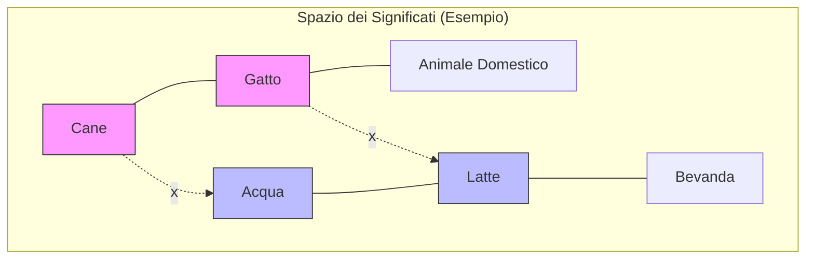
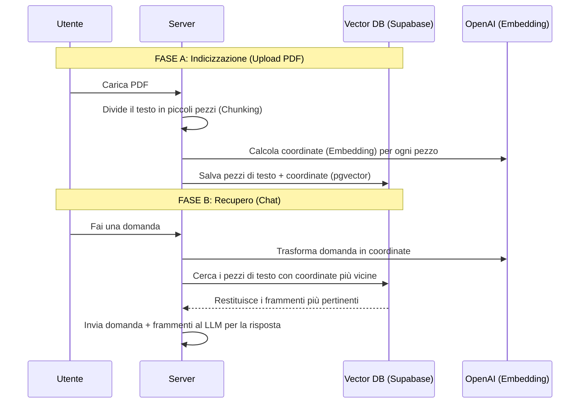

# 06 - RAG e Vector Search

Il cuore dell'intelligenza applicata ai documenti in questo progetto è il sistema **RAG (Retrieval-Augmented Generation)**. Questa architettura permette all'applicazione di "leggere" i file caricati dall'utente e rispondere sulla base del loro contenuto specifico, superando i limiti conoscitivi standard dei modelli linguistici.

## 6.1 Fondamenti e Vantaggi del RAG

A differenza di un modello tradizionale che risponde in base a quanto appreso durante il suo addestramento (knowledge cutoff), il sistema RAG agisce come un assistente che consulta un manuale prima di rispondere.

I vantaggi principali di questo approccio nel progetto sono:
- **Conoscenza Verticale:** Il sistema "sa" cose che il modello base ignora (es. appunti privati, tesine, documenti aziendali).
- **Assenza di Bias e Allucinazioni:** Poiché il modello è istruito a rispondere *solo* citando il testo fornito, si riduce drasticamente il rischio di invenzioni o pregiudizi pre-addestrati.
- **Memoria "Illimitata":** Invece di caricare migliaia di pagine nel prompt (costoso e spesso impossibile per limiti di spazio), salviamo miliardi di informazioni nel database e recuperiamo solo quelle necessarie al momento.

## 6.2 Il Concetto di Spazio Vettoriale (Embedding)

Per permettere al computer di "capire" il significato semantico, trasformiamo le parole in coordinate matematiche chiamate **vettori**. Immaginiamo una mappa dove concetti simili sono geograficamente vicini:

In questo grafico:
- **Cane** e **Gatto** sono vicini perché appartengono alla categoria "Animali".
- **Acqua** e **Latte** sono vicini perché appartengono alla categoria "Liquidi/Bevande".
- La distanza tra **Cane** e **Acqua** è elevata, indicando che i due concetti non sono semanticamente correlati nel contesto della ricerca.

## 6.3 Architettura della Pipeline

Il processo si divide in due flussi principali gestiti tra il server Node.js e il database Supabase.

## 6.4 Meccanismo Matematico: La Similarità del Coseno

Per calcolare quanto due concetti siano "vicini" nello spazio vettoriale, il sistema utilizza la **Similarità del Coseno**. 

Matematicamente, non misuriamo la distanza in linea retta tra due punti, ma l'**angolo** tra i due vettori che partono dall'origine:

$$
\text{Similarity} = \cos(\theta) = \frac{\mathbf{A} \cdot \mathbf{B}}{\|\mathbf{A}\| \|\mathbf{B}\|}
$$

- Se l'angolo è **0°** ($\cos = 1$): I due testi sono quasi identici nel significato.
- Se l'angolo è **90°** ($\cos = 0$): I testi non hanno alcuna correlazione.

Nel progetto, utilizziamo una soglia di **0.4**: se la similarità tra la domanda dell'utente e un frammento del PDF è superiore a questo valore, il pezzo viene considerato utile per generare la risposta.

## 6.5 Implementazione Tecnica
- **Backend:** Gestito in server/routes/documents.ts che utilizza pdf-parse per la lettura e text-embedding-3-small for la vettorializzazione.
- **Database:** Utilizzo dell'estensione pgvector su Supabase per ricerche fulminee su migliaia di frammenti.
- **Frontend:** Il file client/src/library/sendEmbeddingMessage.ts coordina l'invio della domanda e la visualizzazione della risposta aumentata.
