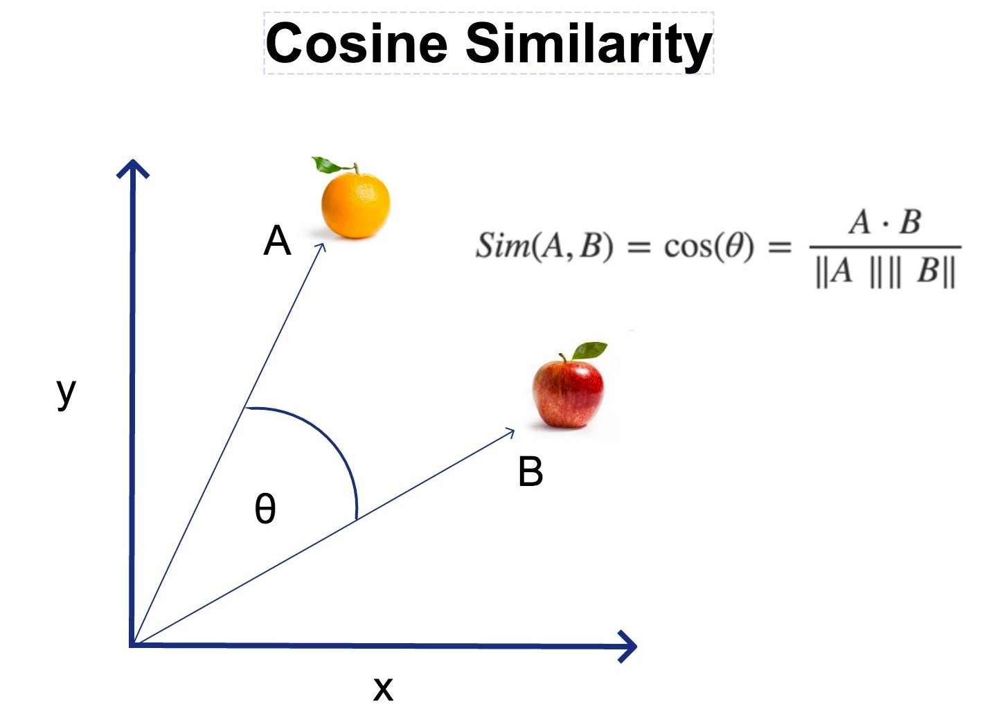

# 06 - RAG e Vector Search: Il Cuore della Conoscenza

Il **RAG (Retrieval Augmented Generation)** è la funzionalità che consente a SmartAI di interrogare documenti PDF complessi restituendo risposte precise e ancorate al testo, evitando il fenomeno delle "allucinazioni" — risposte plausibili ma inventate, del tutto scollegate dal materiale fornito.

---

## 6.1 Fondamenti e Vantaggi del RAG

Il sistema RAG funziona come un assistente che consulta un manuale prima di rispondere, invece di affidarsi esclusivamente alla memoria. I vantaggi principali sono:

- **Conoscenza Verticale**: Il sistema acquisisce informazioni che il modello base non conosce, come appunti privati, tesine, report aziendali o qualsiasi documento personale.
- **Riduzione delle Allucinazioni**: Poiché il modello è istruito a rispondere *solo* citando il testo fornito, il rischio di risposte inventate si riduce drasticamente.
- **Memoria Praticamemte Illimitata**: Invece di caricare centinaia di pagine nel prompt, il sistema salva i contenuti nel database e recupera solo i frammenti pertinenti al momento della domanda.

---

## 6.2 La Strategia di Chunking Ricorsivo

Per consentire all'IA di elaborare un documento di 100 pagine, non è possibile inviarlo interamente in una sola volta. Il testo viene suddiviso in frammenti chiamati **chunk**, seguendo questa pipeline:

1. **Normalizzazione**: Pulizia del testo con rimozione di caratteri di controllo e normalizzazione Unicode (NFC).
2. **Heading Detection**: Il sistema identifica i titoli delle sezioni (es. "Capitolo 1", "1.2 Obiettivi") per preservare la struttura gerarchica del documento.
3. **Split Multilivello**:
   - Si parte dai **paragrafi** (doppio newline).
   - Se un paragrafo supera la dimensione massima, si scende alle **frasi**.
   - Se necessario, si arriva alle **singole parole**.
4. **Overlap (Sovrapposizione)**: Ogni chunk mantiene circa 300 caratteri del frammento precedente, in modo da non perdere il contesto semantico tra la fine di un pezzo e l'inizio del successivo.

---

## 6.3 Il Concetto di Spazio Vettoriale (Embedding)

Ogni frammento di testo viene trasformato in un insieme di coordinate numeriche chiamato **vettore** o **embedding**. Si può immaginare una mappa multidimensionale dove i concetti semanticamente simili si trovano geograficamente vicini. Per questa trasformazione viene utilizzato il modello `text-embedding-3-small`, che produce vettori da **1536 dimensioni**.

---

## 6.4 Meccanismo Matematico: La Similarità del Coseno

Per stabilire quanto due concetti siano semanticamente vicini, il sistema utilizza la **Similarità del Coseno**: misura l'angolo formato tra il vettore della domanda dell'utente e i vettori dei frammenti salvati nel database.

$$
\text{Similarity} = \cos(\theta) = \frac{\mathbf{A} \cdot \mathbf{B}}{\|\mathbf{A}\| \|\mathbf{B}\|}
$$

I valori si interpretano così:

- **1.0** → Significato identico.
- **0.4** → Soglia minima di pertinenza adottata nel progetto.
- **0.0** → Nessuna correlazione semantica.


<small>L'illustrazione mostra la similarità del coseno applicata a due concetti (mela e arancia): più i due vettori sono vicini nello spazio, maggiore è il valore di similarità.</small>

---

## 6.5 Ottimizzazione: La Funzione RPC su PostgreSQL

Per gestire migliaia di frammenti in pochi millisecondi, è stata implementata una funzione **RPC (Remote Procedure Call)** direttamente in PostgreSQL su Supabase, sfruttando l'estensione `pgvector`:

```sql
CREATE OR REPLACE FUNCTION match_documents (
  query_embedding vector(1536),
  match_threshold float,
  match_count int,
  filter_user_id uuid,
  selected_id uuid
)
RETURNS TABLE (
  id uuid,
  content text,
  similarity float,
  metadata jsonb
)
LANGUAGE plpgsql
AS $$
BEGIN
  RETURN QUERY
  SELECT
    documents.id,
    documents.content,
    1 - (documents.embedding <=> query_embedding) AS similarity,
    documents.metadata
  FROM documents
  WHERE documents.user_id = filter_user_id
    AND documents.document_id = selected_id
    AND 1 - (documents.embedding <=> query_embedding) > match_threshold
  ORDER BY documents.embedding <=> query_embedding
  LIMIT match_count;
END;
$$;
```

L'operatore `<=>` calcola la distanza coseno tra vettori: i risultati vengono ordinati per rilevanza e restituiti solo se superano la soglia minima impostata.

---

## 6.6 Flusso RAG: Dal PDF alla Risposta

Di seguito è illustrato il percorso completo dei dati, dal caricamento del documento fino alla risposta generata dall'IA.

<div style="font-family: 'Segoe UI', Tahoma, Geneva, Verdana, sans-serif; padding: 20px; background: #0f172a; border-radius: 15px; color: white;">
    <div style="display: flex; flex-direction: column; gap: 20px;">
        <div style="display: flex; align-items: center; gap: 15px;">
            <div style="background: #3b82f6; width: 40px; height: 40px; border-radius: 50%; display: flex; align-items: center; justify-content: center; font-weight: bold; flex-shrink: 0;">1</div>
            <div style="background: rgba(255,255,255,0.05); padding: 15px; border-radius: 10px; flex-grow: 1; border: 1px solid rgba(59,130,246,0.3);">
                <strong style="color: #60a5fa;">Ingestione PDF</strong><br>
                L'utente carica il documento. Il server estrae il testo grezzo con <code>pdf-parse</code>.
            </div>
        </div>
        <div style="margin-left: 20px; border-left: 2px dashed #334155; height: 20px;"></div>
        <div style="display: flex; align-items: center; gap: 15px;">
            <div style="background: #10b981; width: 40px; height: 40px; border-radius: 50%; display: flex; align-items: center; justify-content: center; font-weight: bold; flex-shrink: 0;">2</div>
            <div style="background: rgba(255,255,255,0.05); padding: 15px; border-radius: 10px; flex-grow: 1; border: 1px solid rgba(16,185,129,0.3);">
                <strong style="color: #34d399;">Recursive Chunking</strong><br>
                Il testo viene suddiviso in frammenti da 1500 caratteri con 300 di overlap, preservando titoli e struttura delle frasi.
            </div>
        </div>
        <div style="margin-left: 20px; border-left: 2px dashed #334155; height: 20px;"></div>
        <div style="display: flex; align-items: center; gap: 15px;">
            <div style="background: #f59e0b; width: 40px; height: 40px; border-radius: 50%; display: flex; align-items: center; justify-content: center; font-weight: bold; flex-shrink: 0;">3</div>
            <div style="background: rgba(255,255,255,0.05); padding: 15px; border-radius: 10px; flex-grow: 1; border: 1px solid rgba(245,158,11,0.3);">
                <strong style="color: #fbbf24;">Vectorization & Storage</strong><br>
                Ogni chunk viene convertito in un vettore numerico e salvato su Supabase tramite pgvector.
            </div>
        </div>
        <div style="margin-left: 20px; border-left: 2px dashed #334155; height: 20px;"></div>
        <div style="display: flex; align-items: center; gap: 15px;">
            <div style="background: #ef4444; width: 40px; height: 40px; border-radius: 50%; display: flex; align-items: center; justify-content: center; font-weight: bold; flex-shrink: 0;">4</div>
            <div style="background: rgba(255,255,255,0.05); padding: 15px; border-radius: 10px; flex-grow: 1; border: 1px solid rgba(239,68,68,0.3);">
                <strong style="color: #f87171;">Semantic Retrieval</strong><br>
                Alla domanda dell'utente, la funzione RPC individua i 7 frammenti più pertinenti tramite similarità del coseno.
            </div>
        </div>
        <div style="margin-left: 20px; border-left: 2px dashed #334155; height: 20px;"></div>
        <div style="display: flex; align-items: center; gap: 15px;">
            <div style="background: #8b5cf6; width: 40px; height: 40px; border-radius: 50%; display: flex; align-items: center; justify-content: center; font-weight: bold; flex-shrink: 0;">5</div>
            <div style="background: rgba(255,255,255,0.05); padding: 15px; border-radius: 10px; flex-grow: 1; border: 1px solid rgba(139,92,246,0.3);">
                <strong style="color: #a78bfa;">Augmented Response</strong><br>
                L'IA riceve i frammenti recuperati e costruisce la risposta citando direttamente le fonti, garantendo precisione e tracciabilità.
            </div>
        </div>
    </div>
</div>