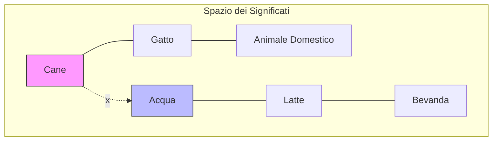

# 06 - RAG e Vector Search: Il Cuore della Conoscenza

Il sistema **RAG (Retrieval-Augmented Generation)** rappresenta il pilastro tecnologico che permette a **Smart AI** di evolvere da semplice chatbot a consulente esperto sui documenti dell'utente. Questa architettura supera i limiti dei modelli linguistici standard (conoscenza statica e "allucinazioni") fornendo un contesto dinamico e verificabile.

---

## 6.1 Fondamenti e Vantaggi del RAG

A differenza di un modello tradizionale che risponde in base a quanto appreso durante il suo addestramento (knowledge cutoff), il sistema RAG agisce come un assistente che consulta un manuale prima di rispondere.

I vantaggi principali di questo approccio nel progetto sono:
-   **Conoscenza Verticale:** Il sistema "sa" cose che il modello base ignora (es. appunti privati, tesine, documenti aziendali).
-   **Assenza di Bias e Allucinazioni:** Poiché il modello è istruito a rispondere *solo* citando il testo fornito, si riduce drasticamente il rischio di invenzioni.
-   **Memoria "Illimitata":** Invece di caricare migliaia di pagine nel prompt, salviamo miliardi di informazioni nel database e recuperiamo solo quelle necessarie al momento.

---

## 6.2 La Strategia di Chunking Ricorsivo

Perché l'AI possa comprendere un documento di 100 pagine, non possiamo inviarlo tutto in una volta. Dobbiamo "spezzettarlo" in frammenti chiamati **chunk**. La nostra pipeline di elaborazione utilizza una strategia **ricorsiva**:

1.  **Normalizzazione**: Pulizia del testo (rimozione caratteri di controllo, normalizzazione NFC).
2.  **Heading Detection**: Il sistema identifica i titoli delle sezioni (es. "Capitolo 1", "1.2 Obiettivi") per mantenere il riferimento gerarchico.
3.  **Split Multilivello**:
    *   Si parte dai **paragrafi** (doppio newline).
    *   Se un paragrafo è troppo grande, si scende alle **frasi**.
    *   Se necessario, si arriva alle **singole parole**.
4.  **Overlap (Sovrapposizione)**: Ogni chunk mantiene una parte del testo precedente (circa 300 caratteri) per non perdere il contesto semantico tra la fine di un frammento e l'inizio del successivo.

---

## 6.3 Il Concetto di Spazio Vettoriale (Embedding)

Trasformiamo i frammenti di testo in coordinate matematiche chiamate **vettori**. Immaginiamo una mappa dove concetti simili sono geograficamente vicini. Per questo usiamo il modello `text-embedding-3-small`, che trasforma ogni chunk in un vettore di 1536 dimensioni.



---

## 6.4 Meccanismo Matematico: La Similarità del Coseno

Per calcolare quanto due concetti siano "vicini", utilizziamo la **Similarità del Coseno**. Misuriamo l'angolo tra il vettore della domanda dell'utente e i vettori dei frammenti salvati:

$$
\text{Similarity} = \cos(\theta) = \frac{\mathbf{A} \cdot \mathbf{B}}{\|\mathbf{A}\| \|\mathbf{B}\|}
$$

*   **1.0**: Significato identico.
*   **0.4**: Soglia minima di pertinenza utilizzata nel progetto.
*   **0.0**: Nessuna correlazione.

---

## 6.5 Ottimizzazione Database: La Funzione RPC

Per gestire migliaia di frammenti in millisecondi, abbiamo implementato una funzione **RPC (Remote Procedure Call)** direttamente in PostgreSQL su Supabase, sfruttando l'estensione `pgvector`.

```sql
-- Funzione per la ricerca semantica ultra-rapida
CREATE OR REPLACE FUNCTION match_documents (
  query_embedding vector(1536),
  match_threshold float,
  match_count int,
  filter_user_id uuid,
  selected_id uuid
)
RETURNS TABLE (
  id uuid,
  content text,
  similarity float,
  metadata jsonb
)
LANGUAGE plpgsql
AS $$
BEGIN
  RETURN QUERY
  SELECT
    documents.id,
    documents.content,
    1 - (documents.embedding <=> query_embedding) AS similarity,
    documents.metadata
  FROM documents
  WHERE documents.user_id = filter_user_id
    AND documents.document_id = selected_id  
    AND 1 - (documents.embedding <=> query_embedding) > match_threshold
  ORDER BY documents.embedding <=> query_embedding
  LIMIT match_count;
END;
$$;
```

Questa funzione utilizza l'operatore `<=>` (distanza coseno) per ordinare i risultati e restituire solo i frammenti più rilevanti.

---

## 6.6 Roadmap Visiva del Flusso RAG

Di seguito è illustrata la "strada" che percorrono i dati, dal caricamento del PDF alla risposta finale generata dall'AI.

<div style="font-family: 'Segoe UI', Tahoma, Geneva, Verdana, sans-serif; padding: 20px; background: #0f172a; border-radius: 15px; color: white;">
    <div style="display: flex; flex-direction: column; gap: 20px;">
        <!-- Step 1 -->
        <div style="display: flex; align-items: center; gap: 15px;">
            <div style="background: #3b82f6; width: 40px; height: 40px; border-radius: 50%; display: flex; align-items: center; justify-content: center; font-weight: bold; flex-shrink: 0;">1</div>
            <div style="background: rgba(255,255,255,0.05); padding: 15px; border-radius: 10px; flex-grow: 1; border: 1px solid rgba(59,130,246,0.3);">
                <strong style="color: #60a5fa;">Ingestione PDF</strong><br>
                L'utente carica il documento. Il server estrae il testo grezzo usando <code>pdf-parse</code>.
            </div>
        </div>
        <!-- Connector -->
        <div style="margin-left: 20px; border-left: 2px dashed #334155; height: 20px;"></div>
        <!-- Step 2 -->
        <div style="display: flex; align-items: center; gap: 15px;">
            <div style="background: #10b981; width: 40px; height: 40px; border-radius: 50%; display: flex; align-items: center; justify-content: center; font-weight: bold; flex-shrink: 0;">2</div>
            <div style="background: rgba(255,255,255,0.05); padding: 15px; border-radius: 10px; flex-grow: 1; border: 1px solid rgba(16,185,129,0.3);">
                <strong style="color: #34d399;">Recursive Chunking</strong><br>
                Il testo viene diviso in frammenti da 1500 caratteri con 300 di overlap, preservando titoli e frasi.
            </div>
        </div>
        <!-- Connector -->
        <div style="margin-left: 20px; border-left: 2px dashed #334155; height: 20px;"></div>
        <!-- Step 3 -->
        <div style="display: flex; align-items: center; gap: 15px;">
            <div style="background: #f59e0b; width: 40px; height: 40px; border-radius: 50%; display: flex; align-items: center; justify-content: center; font-weight: bold; flex-shrink: 0;">3</div>
            <div style="background: rgba(255,255,255,0.05); padding: 15px; border-radius: 10px; flex-grow: 1; border: 1px solid rgba(245,158,11,0.3);">
                <strong style="color: #fbbf24;">Vectorization & Storage</strong><br>
                Ogni chunk diventa un vettore numerico e viene salvato su Supabase (pgvector).
            </div>
        </div>
        <!-- Connector -->
        <div style="margin-left: 20px; border-left: 2px dashed #334155; height: 20px;"></div>
        <!-- Step 4 -->
        <div style="display: flex; align-items: center; gap: 15px;">
            <div style="background: #ef4444; width: 40px; height: 40px; border-radius: 50%; display: flex; align-items: center; justify-content: center; font-weight: bold; flex-shrink: 0;">4</div>
            <div style="background: rgba(255,255,255,0.05); padding: 15px; border-radius: 10px; flex-grow: 1; border: 1px solid rgba(239,68,68,0.3);">
                <strong style="color: #f87171;">Semantic Retrieval</strong><br>
                Alla domanda dell'utente, l'RPC cerca i 7 frammenti più simili tramite similarità del coseno.
            </div>
        </div>
        <!-- Connector -->
        <div style="margin-left: 20px; border-left: 2px dashed #334155; height: 20px;"></div>
        <!-- Step 5 -->
        <div style="display: flex; align-items: center; gap: 15px;">
            <div style="background: #8b5cf6; width: 40px; height: 40px; border-radius: 50%; display: flex; align-items: center; justify-content: center; font-weight: bold; flex-shrink: 0;">5</div>
            <div style="background: rgba(255,255,255,0.05); padding: 15px; border-radius: 10px; flex-grow: 1; border: 1px solid rgba(139,92,246,0.3);">
                <strong style="color: #a78bfa;">Augmented Response</strong><br>
                L'AI riceve i frammenti e risponde citando le fonti, garantendo precisione millimetrica.
            </div>
        </div>
    </div>
</div>

---

## 6.7 Conclusioni: L'AI come Ricercatore
L'implementazione del RAG trasforma l'intelligenza artificiale da un generatore di testi a un vero e proprio **ricercatore semantico**. Questo approccio non solo aumenta l'affidabilità delle risposte, ma permette un'interazione profonda con la conoscenza personale dell'utente, rendendo **Smart AI** uno strumento indispensabile per lo studio e il lavoro professionale.
