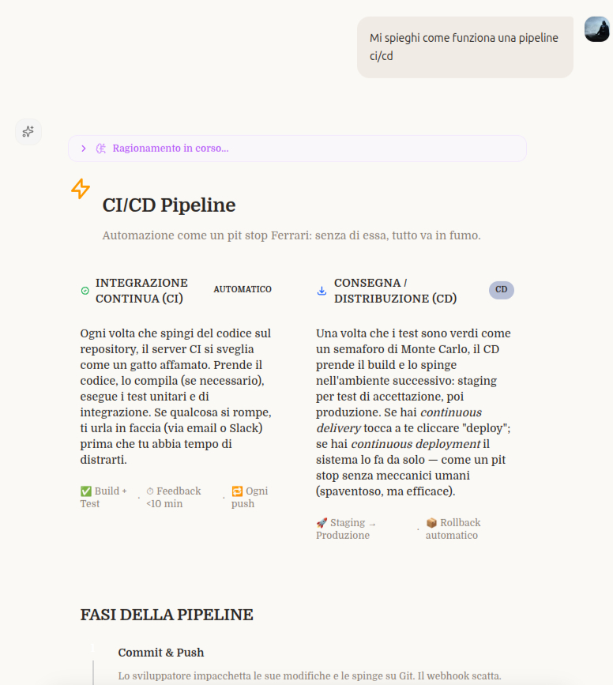
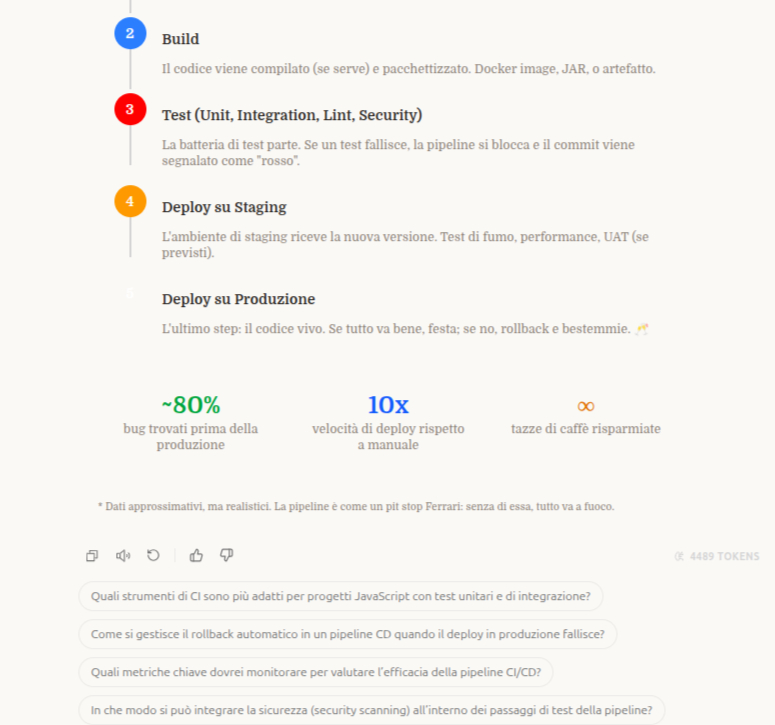
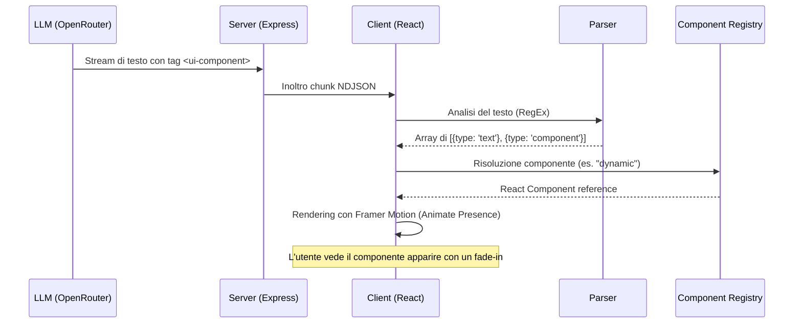

# 07 - Generative UI: L'Interfaccia che Prende Forma

Uno dei limiti storici dei chatbot è la loro natura puramente testuale. In **SmartAI**, abbiamo superato questo vincolo implementando la **Generative UI**: un sistema che permette all'intelligenza artificiale di "decidere" non solo cosa dire, ma anche come mostrarlo, generando componenti grafici interattivi in tempo reale.



In queste foto si vede come l'IA abbia generato dei componenti grafici per mostrare le card di una pipeline CI/CD e una roadmap semplice di come funziona
---

## 7.1 Il Protocollo di Comunicazione

Il segreto della Generative UI risiede in un protocollo di messaggistica ibrido. L'AI risponde in Markdown standard, ma quando deve mostrare dati strutturati, inserisce dei tag XML-like nel flusso di testo:

```xml
Ecco un riepilogo delle tue spese:

<ui-component type="dynamic">
  {
    "root": {
      "type": "container",
      "props": { "direction": "row", "gap": 4 },
      "children": [
        { "type": "metric", "props": { "label": "Totale", "value": "€1.240", "trend": "+12%" } },
        { "type": "progress", "props": { "label": "Budget", "value": 80, "max": 100, "color": "emerald" } }
      ]
    }
  }
</ui-component>
```

Il client intercetta questi tag tramite un **Parser RegEx** avanzato (`parseGenerativeUI.ts`) e divide il messaggio in "chunk" di testo e "chunk" di componenti React.

---

## 7.2 L'Architettura del Renderer

Il componente `GenerativeUIRenderer` funge da orchestratore. Riceve la stringa grezza dall'AI e coordina il rendering:

1.  **Parsing**: Divide il testo dai componenti.
2.  **Lookup**: Consulta il `COMPONENT_REGISTRY` per trovare il componente React corrispondente al `type`.
3.  **Injection**: Passa il payload JSON come `data` al componente.
4.  **Fallback**: Se il JSON è malformato (accade spesso durante lo streaming), il sistema renderizza il testo grezzo per evitare la perdita di informazioni.

---

## 7.3 I Due Pilastri: Dynamic Canvas e Sandbox

Abbiamo sviluppato due approcci complementari per la generazione della UI:

### A. Dynamic Canvas (Low-Code Architecture)
È un sistema di componenti atomici pre-definiti (Text, Metric, Progress, Icon, Container). 
- **Vantaggio**: Coerenza estetica assoluta con il design system dell'app.
- **Sicurezza**: L'AI non scrive codice eseguibile, ma compone una struttura dati sicura.
- **Performance**: Estremamente leggero e veloce da renderizzare.

### B. Sandbox (High-Code Architecture)
Quando la complessità lo richiede (es. grafici complessi con Chart.js o D3), l'AI può generare un intero blocco di codice HTML, CSS e JavaScript.
- **Isolamento**: Il codice gira all'interno di un `<iframe>` con l'attributo `sandbox="allow-scripts"`.
- **Librerie Auto-iniettate**: La Sandbox include automaticamente TailwindCSS, Chart.js e D3 per permettere visualizzazioni professionali senza sforzo.
- **Resizing Dinamico**: Un `ResizeObserver` comunica al client l'altezza esatta del contenuto per evitare barre di scorrimento antiestetiche.

---

## 7.4 Flusso di Generazione (UML)

Il seguente diagramma descrive il viaggio di un componente dalla mente dell'AI allo schermo dell'utente.



---

## 7.5 Sfide Tecniche e Ottimizzazioni

*   **Streaming Content**: Durante la generazione, il tag XML è incompleto. Il parser è istruito per ignorare i tag aperti fino a quando non sono chiusi o validi, garantendo che l'interfaccia non "salti" durante la digitazione.
*   **Memoizzazione**: Usiamo `React.memo` intensivamente sui renderer per evitare ricaricamenti costosi dell'iframe Sandbox ogni volta che arriva un nuovo token di testo.
*   **Design Tokens**: Il `DynamicCanvas` mappa i nomi dei colori dell'AI (es. "emerald") su classi Tailwind specifiche, mantenendo l'armonia cromatica con la Dark Mode dell'applicazione.
