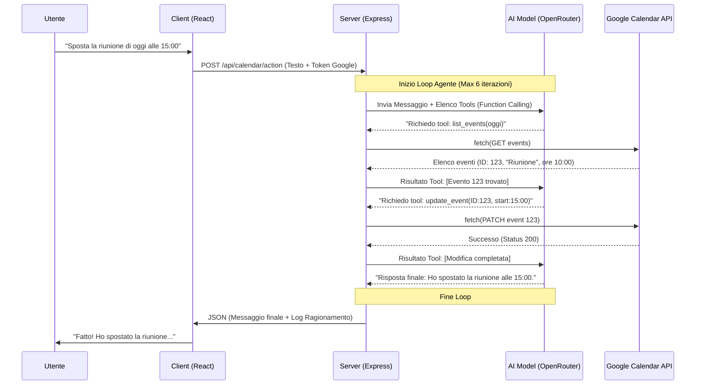

# 08 - Integrazione Calendario: L'Era degli AI Agents

In questo capitolo esploreremo come il progetto **Smart AI** superi il concetto di semplice "visualizzatore di dati" per diventare un sistema proattivo attraverso l'integrazione di un **AI Agent** dedicato alla gestione del tempo. Non si tratta solo di mostrare degli impegni su una griglia, ma di permettere a un'intelligenza artificiale di interagire attivamente con il mondo esterno (in questo caso, Google Calendar).

---

## 1. Che cos'è un AI Agent?

A differenza di un chatbot tradizionale che si limita a generare testo, un **AI Agent** (Agente Artificiale) è un sistema capace di **ragionare, pianificare ed eseguire azioni** per raggiungere un obiettivo. Se chiedi a un chatbot "Quando sono libero domani?", lui potrebbe solo rispondere. Un Agente, invece, va a leggere il tuo calendario, analizza i buchi liberi e ti propone una soluzione, o addirittura prenota l'appuntamento per te.

Possiamo immaginare l'Agente come un "cervello" (il Modello di Linguaggio) collegato a delle "mani" (le API di Google Calendar).

### I 4 Pilastri del Flusso Agente
Per rendere l'integrazione fluida e affidabile, abbiamo implementato un flusso basato su quattro fasi chiave:

1.  **Percezione e Contesto**: L'agente riceve la richiesta dell'utente insieme a informazioni vitali "di sistema", come la data e l'ora corrente e il fuso orario. Senza sapere che "oggi è lunedì", l'agente non potrebbe capire cosa significa "fissa per domani".
2.  **Ragionamento (Reasoning)**: L'LLM analizza la richiesta. Se l'utente dice "Sposta la riunione con Marco a mercoledì", l'agente capisce che deve prima *cercare* la riunione esistente e poi *modificarla*.
3.  **Pianificazione e Selezione Strumenti**: L'AI decide quale "tool" (funzione) chiamare. Nel nostro sistema, ha a disposizione strumenti come `list_events`, `create_event` e `delete_event`.
4.  **Azione e Osservazione**: L'agente esegue la chiamata API, riceve il risultato (es. "Evento creato con successo") e lo "osserva" per formulare la risposta finale all'utente.

---

## 2. Il Flusso di Lavoro (Diagramma UML)

Il cuore tecnico dell'integrazione risiede nel **ciclo di feedback** tra il server e l'intelligenza artificiale. Di seguito è illustrato il processo esatto che avviene quando un utente interagisce con la *Floating Chat* del calendario.

---

## 3. Implementazione Tecnica e "Function Calling"

L'aspetto più sofisticato non è la chiamata API in sé, ma il modo in cui l'AI "decide" di usarla. Questo avviene tramite una tecnica chiamata **Function Calling**.

### Come l'AI "usa" il codice
Abbiamo definito per l'AI uno schema JSON che descrive cosa può fare. Per esempio:
*   **Nome**: `create_event`
*   **Descrizione**: "Crea un nuovo impegno sul calendario."
*   **Parametri**: Titolo, Descrizione, Data Inizio, Data Fine.

Quando l'utente parla, il modello non scrive codice, ma restituisce un oggetto strutturato che dice: *"Ehi server, per favore esegui la funzione `create_event` con questi dati"*. Il nostro server Express agisce quindi come un esecutore fidato, effettuando la chiamata reale a Google con il token OAuth2 dell'utente.

### L'Assistente "Floating"
L'interfaccia utente è stata progettata per non essere invasiva. Una **Floating Chat** (chat fluttuante) sovrapposta al calendario permette all'utente di:
*   Vedere i "pensieri" dell'AI (il ragionamento step-by-step).
*   Cambiare modello al volo (es. passare a un modello più veloce o uno più intelligente).
*   Interagire con il calendario mentre lo guarda, vedendo gli eventi apparire o spostarsi in tempo reale grazie alla reattività di React.

---

## 4. Conclusione: Perché un Agente?

L'integrazione del calendario in **Smart AI** non è un semplice widget, ma una dimostrazione di come l'intelligenza artificiale possa agire come **ponte tra il linguaggio naturale e le interfacce tecniche**. 

Invece di navigare tra menu, selezionare orari e scrivere titoli, l'utente esprime un desiderio ("Organizza una cena con amici venerdì sera") e l'AI si occupa della logica: controlla la disponibilità, formatta i dati secondo gli standard ISO 8601 e comunica con i server di Google. Questo rappresenta il futuro della produttività: meno "clic", più conversazione.
