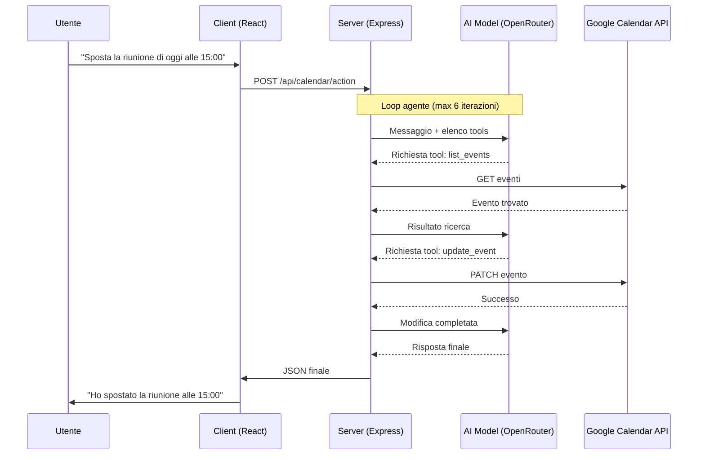

# 08 - Integrazione Calendario: AI Agents

Con un semplice messaggio, l’AI può leggere il calendario, creare eventi, modificarli o eliminarli grazie all’integrazione con Google Calendar.

---

## 8.1 Che cos’è un AI Agent?

Un chatbot classico si limita a generare testo. Un **AI Agent**, invece, può anche eseguire azioni per raggiungere un obiettivo.

Ad esempio, se un utente chiede: *"Quando sono libero domani?"*, un chatbot normale potrebbe solo suggerire di controllare il calendario. Un AI Agent, invece, può leggere gli eventi presenti, trovare gli orari liberi e persino creare un appuntamento.

### I 4 passaggi principali

Per far funzionare correttamente l’agente sono necessari quattro elementi:

1. **Contesto**
   
   L’agente riceve il messaggio dell’utente insieme a informazioni importanti come data, ora e fuso orario. In questo modo riesce a capire richieste come *"sposta a domani"* oppure *"fissa per venerdì sera"*.

2. **Ragionamento**
   
   Il modello analizza la richiesta e decide cosa fare. Se l’utente scrive *"Sposta la riunione con Marco a mercoledì"*, l’agente capisce che deve prima cercare l’evento e poi modificarlo.

3. **Scelta degli strumenti**
   
   L’AI seleziona la funzione più adatta tra quelle disponibili, ad esempio:
   
   - `list_events`
   - `create_event`
   - `update_event`
   - `delete_event`

4. **Esecuzione**
   
   Il server esegue la richiesta tramite le API di Google Calendar e restituisce il risultato all’AI, che genera poi la risposta finale per l’utente.

---

## 8.2 Flusso di lavoro

Il funzionamento dell’integrazione si basa su un ciclo continuo tra server e modello AI. Il diagramma seguente mostra cosa succede quando un utente usa la chat del calendario.

---

## 8.3 Implementazione Tecnica e "Function Calling"

La parte più importante dell’integrazione è il Function Calling, cioè il sistema che permette all’AI di usare funzioni reali del server.
### Come l'AI "usa" il codice
Abbiamo definito per l'AI uno schema JSON che descrive cosa può fare. Per esempio:
*   **Nome**: `create_event`
*   **Descrizione**: "Crea un nuovo impegno sul calendario."
*   **Parametri**: Titolo, Descrizione, Data Inizio, Data Fine.

Quando l’utente invia un messaggio, il modello non esegue direttamente il codice. Restituisce invece una richiesta strutturata che indica quale funzione usare e con quali dati.

Il server Express riceve la richiesta ed esegue la vera chiamata alle API di Google Calendar usando il token OAuth2 dell’utente.
### L'Assistente "Floating"
L'interfaccia utente è stata progettata per non essere invasiva. Una **Floating Chat** (chat fluttuante) o in modalità sidebar permette all'utente di interagire con l'AI mentre consulta i propri impegni. L'utente può anche cambiare modello al volo (es. passare a un modello più veloce o uno più intelligente), e interagire con il calendario mentre lo guarda, vedendo gli eventi apparire o spostarsi in tempo reale grazie alla reattività di React.

### 8.4 Funzionalità Avanzate: Generative UI e Fuso Orario Dinamico

Per aumentare l'efficienza e migliorare l'esperienza utente (UI/UX), il workflow agentico è stato potenziato con due importanti caratteristiche:

1. **Schede Grafiche Interattive (Generative UI)**:
   Invece di limitarsi a risposte testuali in markdown o tabelle, l'agente comunica con il frontend tramite tag speciali `<ui-component type="calendar">` contenenti i dati strutturati in JSON degli eventi. Il client intercetta questi blocchi e li renderizza come schede grafiche eleganti che mostrano chiaramente:
   * Lo stato dell'azione (Evento Creato, Modificato, Eliminato o Trovato).
   * Data e ora formattati in locale.
   * Luogo, descrizione dettagliata e un collegamento diretto a Google Calendar.

2. **Sincronizzazione Dinamica del Fuso Orario (Timezone)**:
   Il client rileva in tempo reale il fuso orario impostato nel browser dell'utente (tramite l'API standard `Intl.DateTimeFormat().resolvedOptions().timeZone`) e lo trasmette al server. Il server inietta questo fuso orario sia nel contesto di date fornite all'agente (es. per calcolare correttamente concetti relativi come *"venerdì prossimo"* o *"domani alle 10"*) sia nelle chiamate di scrittura/lettura delle API di Google Calendar, prevenendo errori di prenotazione e sovrapposizioni orarie indipendentemente da dove si trovi l'utente.

---

Invece di navigare tra menu, selezionare orari e scrivere titoli, l'utente esprime un desiderio ("Organizza una cena con amici venerdì sera") e l'AI si occupa della logica: controlla la disponibilità, formatta i dati secondo gli standard ISO 8601 e comunica con i server di Google. Questo rappresenta il futuro della produttività: meno "clic", più conversazione.

