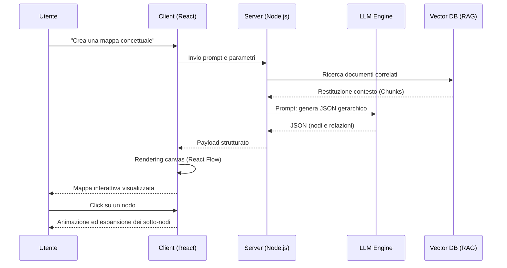
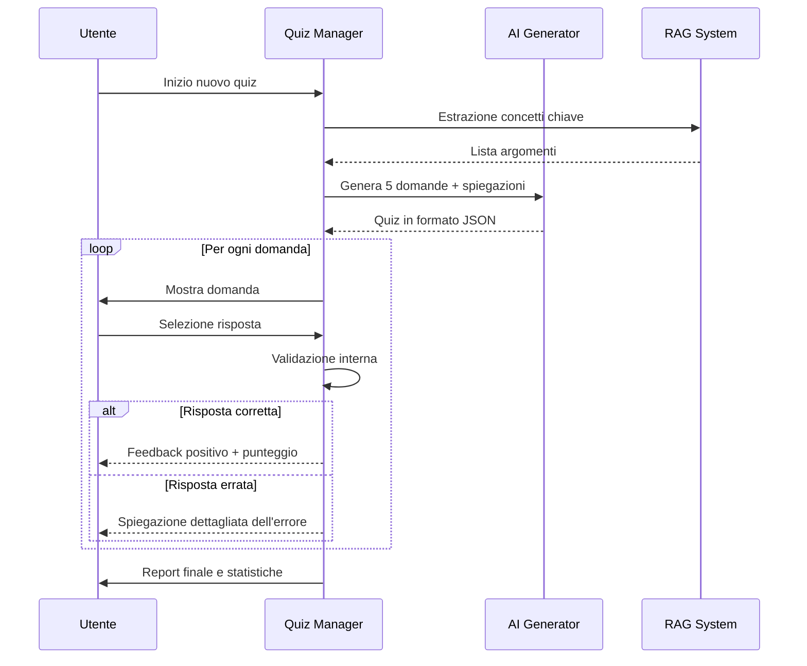
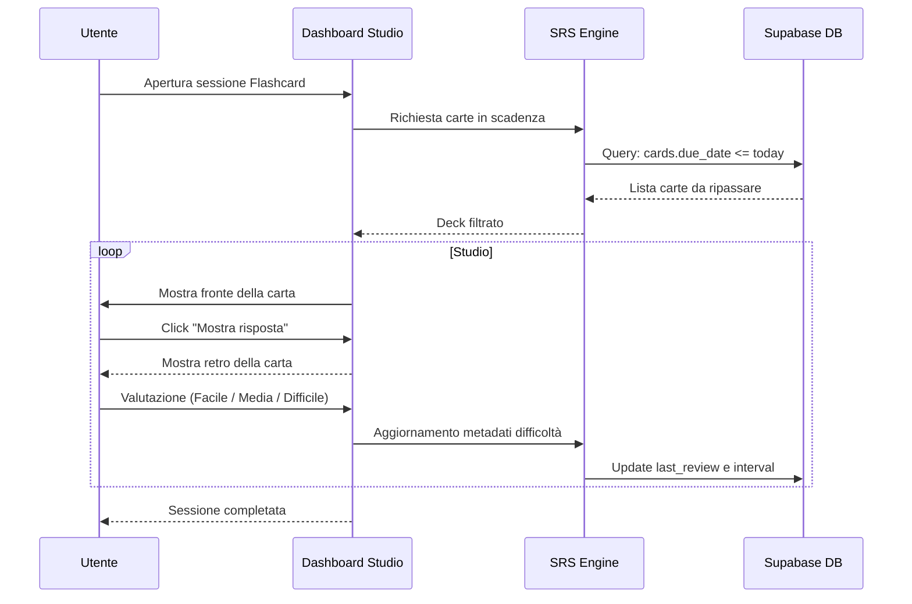
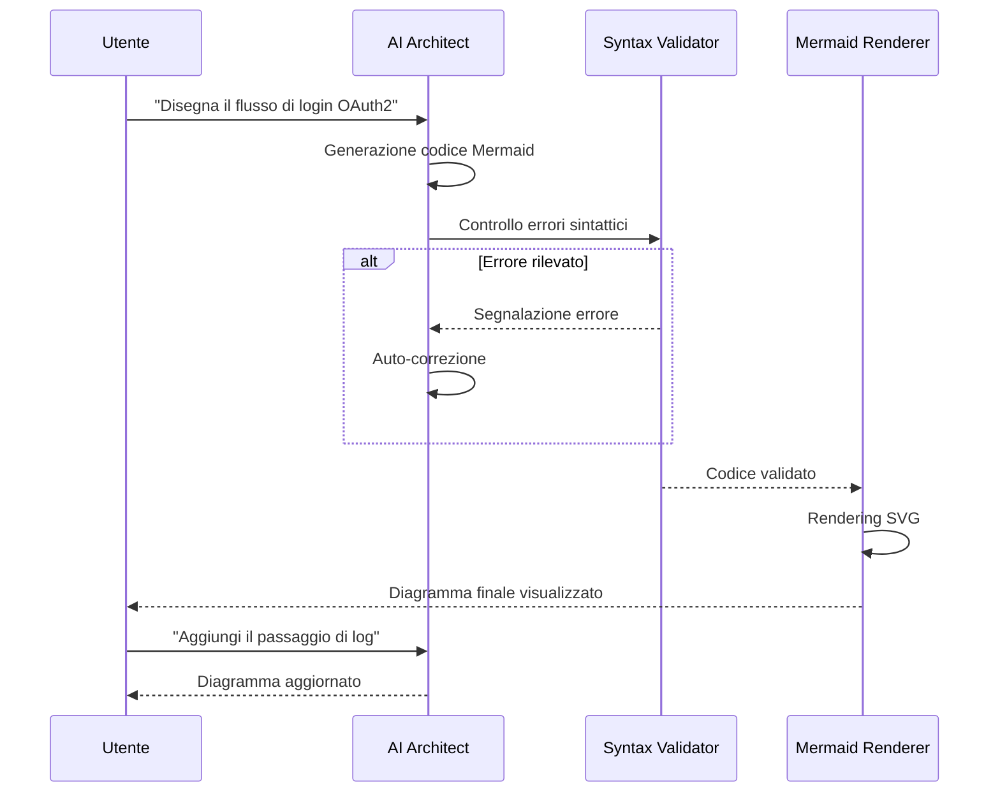

# 09 - Strumenti di Apprendimento: Mindmap, Quiz, Flashcard e Diagrammi

Questo capitolo esplora la dimensione educativa di SmartAI, analizzando come l'architettura del sistema supporti metodi pedagogici moderni come l'**Apprendimento Costruttivista**. In questa visione, l'utente non è un fruitore passivo di contenuti, ma un partecipante attivo che costruisce la propria conoscenza interagendo con strumenti dinamici. SmartAI facilita questo processo riducendo il carico cognitivo e stimolando il pensiero critico.

---

## 9.1 Mappe Mentali e Strutturazione della Conoscenza

Secondo la teoria della doppia codifica di Paivio, l'informazione viene elaborata e memorizzata meglio quando è presentata contemporaneamente in formato verbale e visuale. Le mappe mentali sono il pilastro della visualizzazione concettuale in SmartAI: a differenza di una lettura lineare, permettono di cogliere immediatamente le relazioni gerarchiche e spaziali tra i concetti.

---

## 9.2 Quiz Interattivi e Valutazione Formativa

Il modulo Quiz implementa la **Valutazione Formativa**: una valutazione continua che avviene durante il processo di apprendimento, pensata per identificare lacune in tempo reale, non per assegnare un voto finale.

### Tipologie di Domande e Feedback Adattivo

L'IA genera domande di tre tipologie:

- **Scelta Multipla**: per testare il riconoscimento di fatti e definizioni.
- **Vero/Falso**: per verificare la comprensione di concetti fondamentali.
- **Domande di Ragionamento**: in cui l'utente deve collegare due concetti tra loro.

Il feedback non si limita a "Corretto" o "Errato". SmartAI genera una **spiegazione contestuale** che chiarisce il perché una risposta sia sbagliata, citando direttamente i documenti caricati dall'utente tramite il sistema RAG.

---

## 9.3 Flashcard e Ripetizione Spaziata (SRS)

Le Flashcard di SmartAI si basano sul **Sistema Leitner**, una tecnica di studio che ottimizza il tempo di ripasso concentrandosi sui concetti più difficili da ricordare.

### Integrazione Algoritmica

Ogni interazione con una flashcard aggiorna i metadati della carta nel database:

- **Ease Factor**: Un moltiplicatore che determina l'intervallo di tempo prima del prossimo ripasso.
- **Interval**: Il numero di giorni tra una sessione di ripasso e la successiva.

---

## 9.4 Generazione e Rendering di Diagrammi UML

In ambito tecnico, saper visualizzare strutture logiche è essenziale. SmartAI funge da **traduttore semantico-grafico**: l'utente descrive un sistema in linguaggio naturale e il modello genera il diagramma corrispondente in sintassi Mermaid.js — diagrammi di classe, di flusso o di sequenza — con rendering in tempo reale.

---

## 9.5 Impatto Didattico

L'integrazione di questi strumenti trasforma il rapporto tra studente e intelligenza artificiale. Non si tratta più di chiedere la risposta, ma di usare l'IA per costruire impalcature cognitive (**scaffolding**): strutture di supporto che rendono accessibili anche gli argomenti più complessi.

I vantaggi principali dell'approccio multimodale adottato sono:

1. **Personalizzazione Massima**: Tutti gli esercizi sono generati a partire dai propri appunti e documenti.
2. **Riduzione dell'Ansia da Studio**: Suddividere argomenti complessi in mappe e schemi rende il lavoro più gestibile e meno intimidatorio.
3. **Versatilità**: Gli strumenti si adattano a qualsiasi materia, dalla storia alla programmazione.

SmartAI si posiziona così non come un semplice generatore di risposte, ma come un catalizzatore tecnologico che rende accessibili metodi di apprendimento scientificamente fondati.