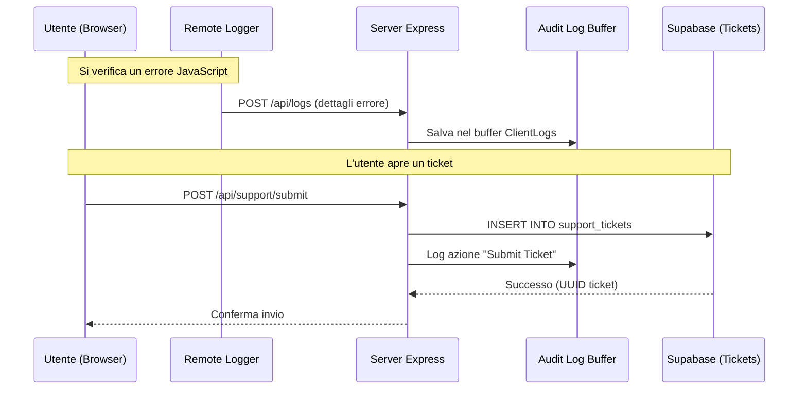

# 10 - Supporto e Manutenibilità

Un sistema complesso come SmartAI non deve solo offrire buone funzionalità, ma anche essere facile da controllare e da supportare.

---

## 10.1 Logging centralizzato

Per tenere sotto controllo il sistema, è stato creato un sistema di logging su due livelli: uno per il server e uno per il client.

### A. Logging del server

Nel backend è stato aggiunto un middleware personalizzato (`httpLoggingMiddleware`) che intercetta ogni richiesta e risposta. Questo permette di:

- **Misurare le prestazioni**: viene salvata la durata in millisecondi di ogni chiamata API.
- **Tenere traccia delle operazioni**: ogni accesso a Supabase e ogni chiamata ai modelli AI viene registrata con data, ora e ID della richiesta.
- **Registrare i messaggi di console**: `console.log` e `console.error` sono stati modificati in modo che ogni messaggio venga salvato anche in un buffer interno di audit, senza perdere il metodo originale.

### B. Remote logging del frontend

Gli errori che si verificano nel browser dell’utente non sono sempre visibili agli sviluppatori. Per questo è stato creato un **Remote Logger**:

- **Rilevamento dei crash**: se l’app React genera un errore non gestito o una Promise viene rifiutata, il client invia subito un report all’endpoint `/api/logs`.
- **Supporto in sviluppo**: durante la fase di sviluppo vengono intercettati anche alcuni errori legati a Vite e all’HMR.
- **Dati completi**: ogni log include stack trace, user agent, IP del client e URL della pagina in cui si è verificato il problema.

Tutti i log sono visibili solo agli amministratori. Nessun dato sensibile viene inviato a servizi esterni.

---

## 10.2 Gestione dei ticket

Il supporto utenti si basa su una tabella dedicata in Supabase (`support_tickets`) e segue questi passaggi:

1. **Creazione**: l’utente compila il form nella Help Page, scegliendo la categoria del problema e scrivendo il messaggio.
2. **Salvataggio**: il ticket viene inserito nel database con stato iniziale `open` e associato all’utente.
3. **Monitoraggio**: l’utente può controllare in ogni momento lo storico dei propri ticket e vedere eventuali risposte degli amministratori.

> [!TODO]
> **Possibile sviluppo futuro**: SmartAI potrebbe analizzare automaticamente il contenuto del ticket con RAG e proporre una risposta iniziale basata sulla documentazione interna, così da ridurre i tempi di attesa.

---

## 10.3 Audit log e sicurezza

Per ogni operazione importante — come l’eliminazione di una conversazione, la modifica dei dati utente o l’accesso da parte di utenti sospetti — il sistema genera un **Audit Log**. Questi record servono a:

- **Sapere chi ha fatto cosa** e in quale momento.
- **Ricostruire eventuali problemi** in caso di errore.
- **Individuare attività anomale** o tentativi di accesso non autorizzati.

---

## 10.4 Flusso di monitoraggio

Il diagramma mostra come un errore nel browser venga inviato al server e salvato nel sistema di monitoraggio.

---

## 10.5 Politica di Retention dei Log

Per evitare di saturare la memoria, il sistema adotta una politica di rotazione automatica:

- **Audit Log Server**: Vengono conservati gli ultimi 500 eventi HTTP e di sistema.
- **Client Log**: Vengono conservati gli ultimi 100 report di crash provenienti dal frontend.
- **Persistenza Selettiva**: solo i ticket di supporto vengono salvati in modo permanente nel database. I log tecnici restano temporanei per mantenere buone prestazioni, ma i limiti possono essere cambiati in qualsiasi momento.