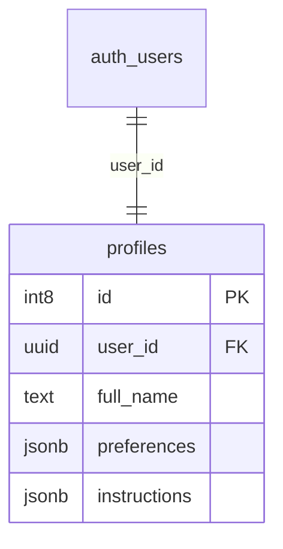
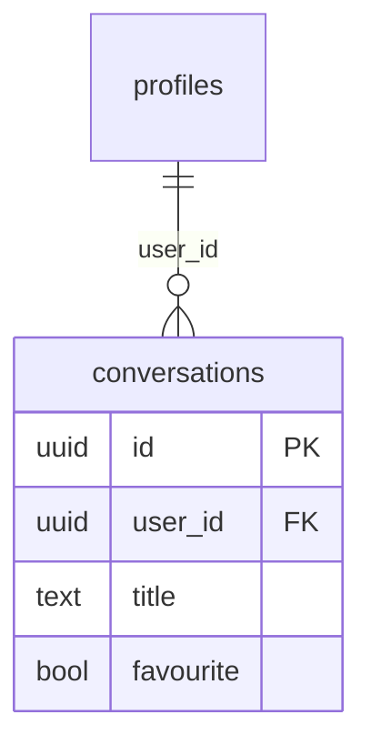
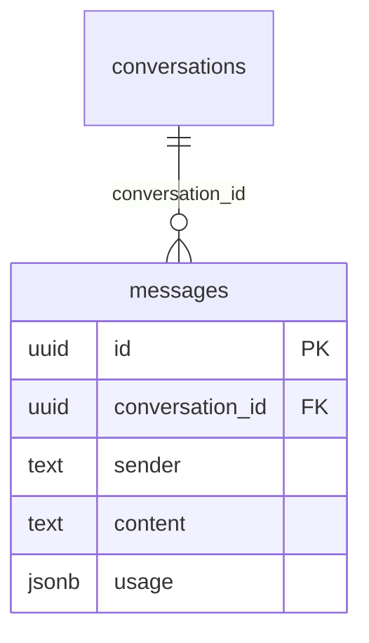
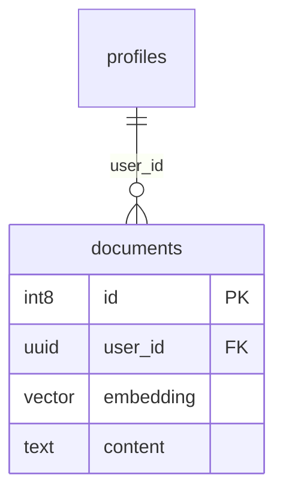
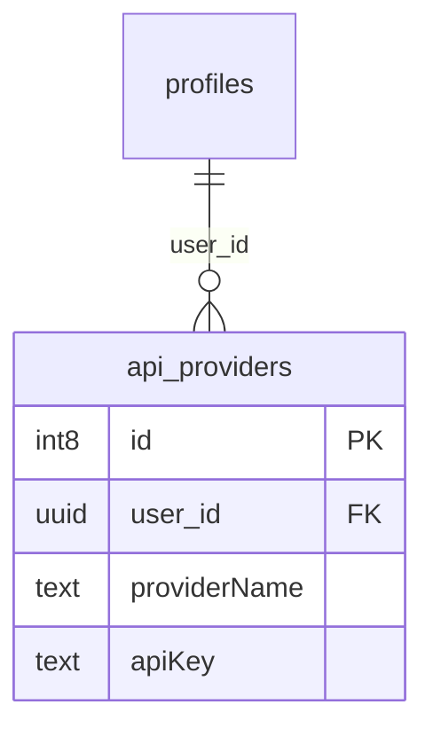
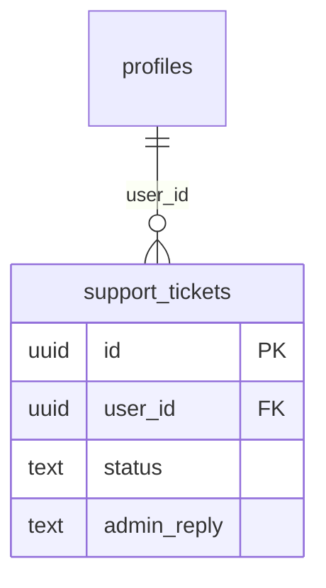

# 11 - Infrastruttura e Database

Di seguito è riportata la struttura del database di SmartAI.

---

## 11.1 Tabella `profiles`

Questa tabella collega il sistema di autenticazione ai dati dell’utente.

### Campi principali

* **`user_id` (UUID)**: collega il profilo alla tabella `auth.users`.
* **`subscription_level` (int2)**: salva il livello di abbonamento dell’utente.
* **`instructions` (jsonb)**: contiene le istruzioni personalizzate usate dall’AI.

Il formato JSONB permette di salvare dati con struttura variabile senza modificare continuamente il database.

---

## 11.2 Tabella `conversations`

Gestisce le conversazioni create dagli utenti.

### Campi principali

* **`id` (UUID)**: identificatore unico della conversazione.
* **`favourite` (bool)**: permette di salvare le chat importanti.
* **`updated_at` (timestamptz)**: usato per ordinare le conversazioni in base all’ultima modifica.

---

## 11.3 Tabella `messages`

Contiene tutti i messaggi delle chat.

### Campi principali

* **`sender` (text)**: indica se il messaggio arriva dall’utente o dall’AI.
* **`content` (text)**: testo del messaggio.
* **`usage` (jsonb)**: salva informazioni sui token utilizzati dai modelli AI.
* **`reasoning_text` (text)**: contiene eventuali passaggi di ragionamento prodotti dal modello.

JSONB viene usato perché modelli diversi restituiscono dati differenti.

---

## 11.4 Tabella `documents`

Questa tabella viene usata dal sistema RAG per la memoria a lungo termine.

### Campi principali

* **`embedding` (vector)**: contiene la rappresentazione numerica del testo.
* **`content` (text)**: testo del documento.
* **`metadata` (jsonb)**: salva informazioni sul file originale, come nome e data.

Il tipo `vector` viene fornito da pgvector ed è necessario per la ricerca semantica.

---

## 11.5 Tabella `api_providers`

Permette agli utenti di usare chiavi API personali.

### Campi principali

* **`providerName` (text)**: nome del provider AI.
* **`apiKey` (text)**: chiave API dell’utente.

In un ambiente di produzione, le chiavi dovrebbero essere crittografate prima del salvataggio.

---

## 11.6 Tabella `support_tickets`

Gestisce il sistema di assistenza.

### Campi principali

* **`problem_type` (text)**: categoria del problema.
* **`status` (text)**: stato del ticket.
* **`admin_reply` (text)**: risposta dell’amministratore.

---

## 11.7 Scelta dei tipi di dato

#### UUID

Usato per le chiavi principali perché rende più difficile prevedere gli ID degli utenti e facilita la scalabilità.

#### JSONB

Permette di salvare dati con struttura variabile senza dover modificare continuamente le tabelle.

#### TIMESTAMPTZ

Serve per gestire correttamente date e orari anche tra utenti con fusi orari diversi.

#### VECTOR

Utilizzato per la ricerca semantica e per le funzionalità AI basate sugli embedding.
