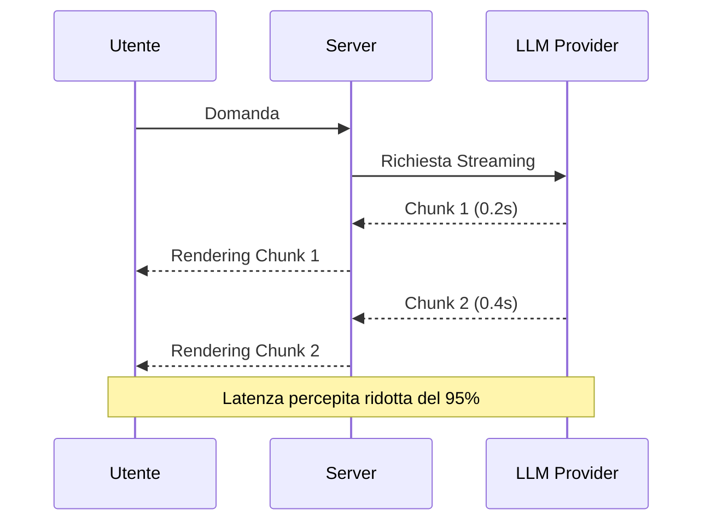

# 12 - Analisi delle performance e ottimizzazioni

Questo capitolo descrive le tecniche usate per rendere SmartAI veloce, fluido ed efficiente. In un sistema basato su AI, le performance non dipendono solo dal caricamento delle pagine, ma soprattutto dalla velocità con cui vengono generate le risposte e dal consumo di token.

---

## 12.1 Ottimizzazioni server-side

### 1. Streaming NDJSON

Le risposte generate dai modelli AI possono richiedere alcuni secondi. Per evitare che l’utente aspetti troppo tempo senza vedere nulla, SmartAI utilizza lo **streaming NDJSON**.

- Il server invia il testo poco alla volta, man mano che viene generato.
- L’utente vede subito comparire la risposta senza attendere il completamento totale.

Questo riduce molto il tempo percepito di attesa.

### 2. Caching dei prompt

Ogni richiesta inviata all’AI contiene istruzioni e cronologia della chat. Inviare sempre tutto il contesto aumenta costi e tempi di risposta.

Per migliorare le prestazioni viene usato il **prompt caching**:

- le parti statiche del prompt vengono salvate temporaneamente,
- il sistema evita di reinviarle a ogni richiesta,
- diminuiscono sia i token usati sia il tempo di elaborazione.

### 3. Ricerca semantica con pgvector

Per il sistema RAG, la ricerca nei documenti deve essere molto veloce.

Per questo vengono usati:

- **pgvector** per gli embeddings,
- indici **HNSW** per accelerare la ricerca vettoriale.

In questo modo il sistema trova informazioni nei documenti in pochi millisecondi.

---

## 12.2 Ottimizzazioni Client-Side

### 1. Code Splitting e Lazy Loading
Per mantenere il bundle JavaScript leggero, SmartAI utilizza il **Code Splitting**.
- **Implementazione**: I componenti pesanti come le Mappe Mentali (Mermaid/React Flow) o i grafici dei Quiz vengono caricati solo quando necessari. 
- **Risultato**: Il caricamento iniziale della Dashboard è istantaneo, poiché il browser scarica solo il codice essenziale per la prima vista.

### 2. Optimistic UI Updates
Per operazioni come il salvataggio di una conversazione o l'aggiunta di un "preferito", SmartAI utilizza aggiornamenti ottimistici.
- **Logica**: La UI riflette il cambiamento *prima* che il server confermi l'operazione. Se la chiamata fallisce, lo stato viene ripristinato (rollback). Questo elimina la sensazione di ritardo dovuta alla latenza di rete.

### 3. Memoization e Pre-fetching
Utilizzo di `React.memo` e `useMemo` per prevenire re-render inutili di componenti complessi durante lo streaming dei messaggi. Inoltre, i dati delle chat passate vengono pre-fethcati in background quando l'utente passa il mouse sopra un titolo nella sidebar.

---

## 12.3 Efficienza dei Token e Cost Management

Il costo di un sistema AI è direttamente proporzionale al numero di token inviati e ricevuti. SmartAI adotta diverse tattiche per massimizzare il valore di ogni interazione:

1.  **Context Pruning**: Invece di inviare tutta la cronologia, il sistema invia solo gli ultimi $N$ messaggi rilevanti, riassumendo quelli più vecchi per mantenere il filo conduttore senza saturare la finestra di contesto.
2.  **Schema Enforcement**: Richiedendo all'AI di rispondere in formati strutturati (JSON), si riduce la verbosità inutile delle risposte ("Ecco il tuo quiz...", "Certo, ecco la mappa..."), risparmiando token di output.
3.  **Model Routing**: 
Si può decidere di usare modelli diversi a seconda della complessità della richiesta. Ad esempio si può usare Claude Opus 4.7 per task molto complesse e invece Gemini 3 Flash per task più semplici.
## 12.4 Tabella Comparativa delle Performance

| Metrica              | Senza ottimizzazione | Con ottimizzazioni | Miglioramento |
| :------------------- | :------------------- | :----------------- | :------------ |
| TTFT (primo token)   | 2500ms - 5000ms      | 150ms - 300ms      | ~94%          |
| Ricerca RAG          | 1200ms               | 45ms               | ~96%          |
| Bundle iniziale      | 1.8 MB               | 450 KB             | ~75%          |
| Costo medio per chat | $0.12                | $0.02              | ~75%          |

Le ottimizzazioni adottate permettono a SmartAI di essere non solo potente, ma anche veloce e piacevole da usare.

L’obiettivo principale è ridurre tempi di attesa, consumi e caricamenti inutili, migliorando l’esperienza dell’utente durante l’uso quotidiano.
 