# SmartAI — Elaborato Completo

Questo documento raccoglie tutti i capitoli della tesina di maturità per il progetto **SmartAI**.

---

# SmartAI - Indice dell'Elaborato

**Studente:** Tommaso Chuxiao Paparesta
**Classe:** 5B Informatica
**Progetto:** SmartAI - L'AI che serve davvero

---

## Mappa dell'Elaborato

**Capitolo 1 — Introduzione**
Perché l'IA, nel modo in cui la utilizziamo oggi, non sfrutta appieno il suo potenziale e come SmartAI si propone di colmare questo divario, introducendo funzionalità pensate per valorizzarne le capacità.

**Capitolo 2 — Architettura Generale**
Panoramica delle tecnologie adottate per la realizzazione del progetto: le dipendenze utilizzate, le scelte architetturali compiute e le motivazioni che le hanno guidate.

**Capitolo 3 — Autenticazione e Sicurezza**
Introduzione al protocollo OAuth2 e descrizione dell'implementazione dell'autenticazione tramite Supabase Auth, con integrazione dei provider Google e GitHub.

**Capitolo 4 — Chat e Interazione con i Modelli LLM**
Come vengono gestite le conversazioni, strutturati i prompt e implementato lo streaming NDJSON per ridurre la latenza percepita dall'utente.

**Capitolo 5 — Gestione della Persistenza**
Come vengono salvate le chat, come si ottimizza lo storage e come è stata implementata la logica di salvataggio e recupero delle conversazioni.

**Capitolo 6 — RAG: Retrieval Augmented Generation**
Descrizione della pipeline RAG integrata nel progetto, con focus sull'embedding dei documenti, la ricerca semantica e la costruzione del prompt da inviare all'LLM.

**Capitolo 7 — Generative UI**
Funzionamento del sistema di Generative UI, in cui l'AI genera componenti grafici interattivi in tempo reale, adattandosi dinamicamente al contesto della conversazione.

**Capitolo 8 — Integrazione Calendario**
Come SmartAI si integra con Google Calendar per automatizzare la gestione degli appuntamenti e delle scadenze.

**Capitolo 9 — Strumenti di Apprendimento: Mindmap, Quiz, Flashcard e Schemi**
Come SmartAI implementa strumenti didattici come mappe mentali, quiz, flashcard e schemi riassuntivi per supportare un apprendimento più efficace e strutturato.

**Capitolo 10 — Supporto e Manutenibilità**
Gestione del sistema di ticketing, dei log applicativi e degli audit log per garantire tracciabilità completa delle operazioni.

**Capitolo 11 — Infrastruttura e Database**
Struttura del database su Supabase: tabelle, relazioni e scelte progettuali alla base dell'intera infrastruttura dati.

**Capitolo 12 — Analisi delle Performance**
Dati alla mano: velocità del sistema, costo per singola interazione e le strategie adottate per ridurre la latenza, ottimizzare l'uso dei token e contenere i costi operativi.

**Capitolo 13 — Conclusioni e Scalabilità**
Il bilancio finale. Cosa ho imparato, quali ostacoli ho superato e, soprattutto, dove potrebbe arrivare SmartAI in futuro — perché ogni buon progetto non finisce davvero con la consegna.

---


---


# 01 - Introduzione

**SmartAI** è una piattaforma pensata per semplificare il lavoro con informazioni, documenti e strumenti digitali. In questo capitolo vengono presentati il contesto in cui nasce il progetto, i suoi obiettivi e le tecnologie usate per realizzarlo.

---

## 1.1 Contesto tecnologico

Negli ultimi anni, l’intelligenza artificiale sta passando dai semplici chatbot a sistemi più completi, capaci non solo di rispondere, ma anche di eseguire azioni e supportare l’utente in modo più attivo.

Tre tendenze hanno influenzato lo sviluppo di SmartAI:

1. **Generative UI**
   
   Le interfacce non restano fisse, ma possono cambiare in base al tipo di contenuto richiesto, mostrando tabelle, grafici o diagrammi quando serve.

2. **Multi-Model Orchestration**
   
   Non si usa un solo modello AI, ma più modelli diversi scelti in base al compito da svolgere, così da bilanciare qualità, velocità e costi.

3. **Integrazione con gli strumenti dell’utente**
   
   L’AI può interagire con calendario, documenti e preferenze personali, diventando un supporto concreto nelle attività quotidiane.

> [!NOTE]
> **Evoluzione del RAG**: oggi la ricerca nei documenti non si basa solo sulle parole chiave, ma anche sulla ricerca semantica, che permette di trovare informazioni più pertinenti.

---

## 1.2 Obiettivi di SmartAI

SmartAI nasce con l’obiettivo di unire queste funzioni in un’unica piattaforma semplice da usare e personalizzabile.

Gli obiettivi principali sono:

- **Ridurre i tempi di lavoro** nella lettura dei documenti e nella gestione delle attività.
- **Adattare l’interfaccia** al tipo di contenuto richiesto, mostrando il formato più utile.
- **Supportare lo studio**, ad esempio con quiz automatici e mappe concettuali create a partire dai documenti.

---

## 1.3 I tre pilastri del progetto

Il progetto si basa su tre elementi principali:

| Pilastro | Descrizione | Risultato |
| :--- | :--- | :--- |
| **Generative UI** | Trasforma l’output dell’AI in componenti visivi interattivi. | Interfaccia più chiara e dinamica. |
| **Didactic Engine** |Mappe concettuali, Schemi, Quiz, Flashcards, Riassunti | Strumenti di studio avanzati. |
| **RAG evoluto** | Analizza PDF e documenti con ricerca semantica. | Risposte più precise e legate ai contenuti reali. |

---

## 1.4 Stack tecnologico

Per costruire SmartAI sono state usate tecnologie moderne, scelte per garantire velocità, stabilità e facilità di manutenzione.

### Frontend e interfaccia
- **React 19**: usato per creare l’interfaccia utente.
- **Vite**: serve per uno sviluppo rapido e fluido.
- **CSS moderno**: usato per definire uno stile personalizzato e ordinato.

### Backend e gestione delle richieste
- **Express 5 (Node.js)**: gestisce le API e il flusso dei dati tra client e server.
- **OpenRouter**: permette di usare diversi modelli AI tramite una sola interfaccia.

### Dati e infrastruttura
- **Supabase**: usato per:
  - autenticazione degli utenti,
  - salvataggio dei dati,
  - gestione delle conversazioni,
  - supporto alla ricerca semantica tramite `pgvector`.


---


# 02 - Architettura Generale

L'architettura di **SmartAI** è stata progettata seguendo i principi di modularità, scalabilità e separazione delle responsabilità (*Separation of Concerns*). Il sistema si basa su un modello **Client-Server** moderno, organizzato in una struttura **Monorepo** — un singolo repository che ospita più progetti distinti — che consente una gestione centralizzata dell'intero ciclo di vita del software.

---

## 2.1 Macro-Architettura Monorepo

Il progetto adotta una struttura Monorepo coordinata tramite **npm workspaces**, che permette di mantenere frontend e backend in un unico repository pur conservando la loro indipendenza operativa.

### Struttura delle Cartelle

- **`/client`**: Applicazione Single Page Application (SPA) costruita con React 19.
- **`/server`**: API Gateway e motore di orchestrazione in Node.js con Express 5.
- **`/docs`**: Documentazione tecnica completa, inclusa questa tesina.

### Schema della Codebase

```text
smart-ai/
├── client/                  # Frontend React 19
│   └── src/
│       ├── components/      # Componenti UI atomici e riutilizzabili
│       ├── context/         # Gestione dello stato globale
│       ├── pages/           # Viste principali dell'applicazione
│       ├── services/        # Client per le chiamate API
│       └── library/         # Componenti per la Generative UI
├── server/                  # Backend Express 5
│   ├── server.ts            # Entry point dell'applicazione
│   ├── routes/              # Definizione degli endpoint API
│   ├── services/            # Logica di business, AI e RAG
│   ├── middleware/          # Gestione auth, log e audit
│   └── utils/               # Helper e funzioni di utilità
└── docs/                    # Documentazione tecnica e tesina
```

### Gestione dei Processi in Sviluppo

Per lo sviluppo locale viene utilizzata la libreria `concurrently`, che consente di avviare simultaneamente il server Vite (frontend) e il processo TSX (backend) con un unico comando, centralizzando tutti i log in un'unica console.

---

## 2.2 Frontend: L'Interfaccia Intelligente (React 19)

Il client è costruito su **React 19**, sfruttando le ultime ottimizzazioni nel rendering. La gestione dello stato globale è affidata alla **Context API**, organizzata in provider specializzati:

- **`AuthContext`**: Gestisce lo stato della sessione e l'integrazione con Supabase Auth.
- **`AppContext`**: Coordina le impostazioni globali dell'applicazione.
- **`SchemaContext` & `CalendarContext`**: Gestiscono gli stati complessi delle funzionalità verticali, rispettivamente le mappe concettuali e il calendario.

### Routing e Protezione delle Rotte

La navigazione è gestita da `react-router-dom` (v6), con una struttura di rotte nidificate:

1. **Rotte Pubbliche**: Landing page, Help, Knowledge base — accessibili da chiunque.
2. **Rotte Protette**: Accessibili solo previa autenticazione. Un componente `ProtectedRoute` verifica la validità del JWT rilasciato da Supabase prima di consentire l'accesso, garantendo la sicurezza dei dati sensibili.

---

## 2.3 Backend: Il Motore di Orchestrazione (Express 5)

Il server funge da **API Gateway** e orchestratore dei servizi AI. L'adozione di **Express 5** garantisce una gestione nativa e più fluida delle rotte asincrone basate su Promise. La persistenza è delegata a **Supabase**, una piattaforma BaaS (*Backend as a Service*) che fornisce database PostgreSQL, autenticazione, storage e API in tempo reale.

### Middleware Stack

Ogni richiesta in ingresso attraversa una pipeline di middleware nell'ordine seguente:

1. **CORS & JSON Parsing**: Configurazione della sicurezza cross-origin e limite del body a 10 MB.
2. **HTTP Logging**: Ogni chiamata viene registrata nel sistema di audit con metodo, percorso, IP e tempo di risposta.
3. **Auth Middleware**: Verifica la validità del token Supabase prima di inoltrare la richiesta alle rotte private.

### Pipeline AI e Streaming

A differenza delle API tradizionali, SmartAI implementa lo **streaming NDJSON**. Quando l'utente invia un messaggio, il server non attende la risposta completa dell'LLM, ma apre un canale di streaming diretto verso il client. Questo approccio riduce drasticamente la latenza percepita, misurata come *Time To First Token (TTFT)*.

---

## 2.4 Persistenza e Integrazioni Esterne

La persistenza e l'intelligenza del sistema sono delegate a due infrastrutture esterne:

1. **Supabase (Ecosistema PostgreSQL)**:
   - **Vector Store**: L'estensione `pgvector` memorizza gli embeddings dei documenti e abilita la ricerca semantica per il sistema RAG.
   - **Database Relazionale**: Gestione di utenti, conversazioni, messaggi e metadati applicativi.

2. **OpenRouter (AI Gateway)**:
   - Funziona come strato di astrazione sopra decine di modelli (OpenAI, Anthropic, Google, Meta e altri).
   - Permette di cambiare il modello in uso dinamicamente, senza modificare il codice del server.

---

## 2.5 Diagrammi Architetturali

### Architettura di Sistema

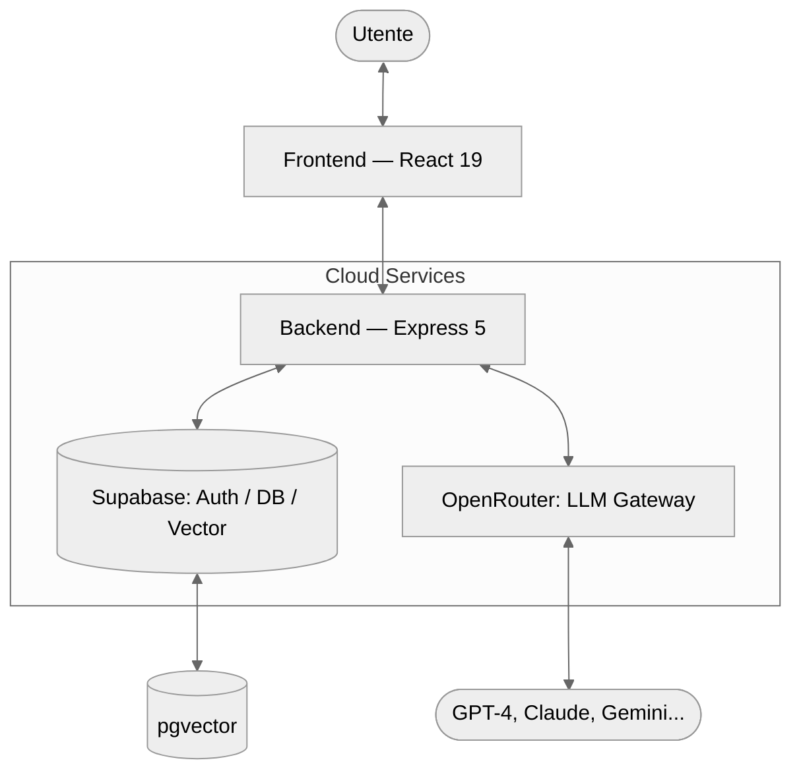

---

## 2.6 Sicurezza e Gestione dei Log

Un componente critico dell'architettura è il sistema di **Unified Audit Log**, che centralizza tre tipologie di informazioni:

1. **Log di Sistema**: Avvio del server ed errori critici.
2. **Log HTTP**: Tracciamento di ogni richiesta in entrata (metodo, path, IP, tempo di risposta).
3. **Log del Client**: Errori JavaScript generati nel browser dell'utente, trasmessi al server tramite l'endpoint `/logs`.

Questa struttura garantisce che ogni malfunzionamento sia tracciabile, rendendo la piattaforma robusta e pronta per un utilizzo in produzione.

---

## 2.7 Appendice: Dipendenze del Progetto

### Frontend (Client)
- **React 19 & Vite**: Core engine e tool di build.
- **Supabase JS**: Integrazione con database e autenticazione.
- **Framer Motion**: Animazioni e micro-interazioni fluide.
- **Lucide React & Phosphor Icons**: Set di icone vettoriali.
- **Marked & KaTeX**: Rendering di Markdown e formule matematiche.
- **Zod**: Validazione degli schemi dati a runtime.

### Backend (Server)
- **Express 5**: Framework web per Node.js.
- **Vercel AI SDK & OpenRouter**: Orchestrazione multi-modello.
- **Supabase JS**: Gestione lato server dei dati e integrazione con `pgvector`.
- **Multer & Express Fileupload**: Gestione dell'upload di file PDF.
- **PDF-parse**: Estrazione del testo dai documenti per il sistema RAG.
- **TSX**: Esecuzione nativa di TypeScript in ambiente Node.js.


---


# 03 - Autenticazione e Sicurezza

Il sistema di autenticazione di **Smart AI** è basato su **Supabase Auth**, una soluzione robusta che gestisce l'intero ciclo di vita dell'utente, dalla registrazione alla gestione delle sessioni sicure tramite JWT (JSON Web Tokens).

---

## 3.1 Funzionamento del Sistema

L'autenticazione segue un approccio moderno e decentralizzato:
1.  **Gestione Sessione**: Al momento del login, Supabase rilascia un JWT che viene memorizzato in modo sicuro nel browser dell'utente.
2.  **Protezione Frontend**: Le rotte sensibili dell'applicazione (Chat, Calendario, Documenti) sono avvolte in un componente `ProtectedRoute` che reindirizza gli utenti non autenticati alla pagina di login.
3.  **Autorizzazione API**: Ogni richiesta inviata al backend include il token JWT nell'header `Authorization`. Il server verifica la validità del token prima di elaborare la richiesta.
4.  **Social Login & Provider**: Il sistema supporta l'accesso tramite **Google** e **GitHub**. Grazie alla configurazione di Supabase, se un utente accede con diversi provider utilizzando la stessa email, gli account vengono automaticamente collegati, evitando la creazione di duplicati e garantendo l'accesso ai medesimi dati.

---

## 3.2 Focus: Cos'è un JWT?

Per capire meglio come funziona la sicurezza dietro le quinte, possiamo immaginare il **JWT (JSON Web Token)** come un **braccialetto elettronico** che ricevi all'ingresso di un club o di un festival:

1.  **Il Check-in**: Quando fai il login, il sistema verifica chi sei e ti consegna questo "braccialetto" digitale.
2.  **Accesso Senza Domande**: Da quel momento in poi, ogni volta che chiedi di vedere i tuoi messaggi o i tuoi documenti, non devi ripetere email e password. Ti basta mostrare il braccialetto (il token) e il server ti lascia passare immediatamente.
3.  **Sicurezza Garantita**: Il braccialetto è firmato digitalmente. Se qualcuno provasse a modificarlo (ad esempio per fingere di essere un altro utente), la firma risulterebbe alterata e il sistema lo rifiuterebbe all'istante.

Questo metodo rende l'applicazione **estremamente veloce** e **sicura**, perché il server sa chi sei semplicemente guardando il token, senza dover andare a cercare ogni volta i tuoi dati nel database principale.

---

---

## 3.4 Flusso di Autenticazione (UML)

Lo schema descrive l'interazione tra l'utente, il client, Supabase e il server durante il processo di autenticazione e accesso ai dati protetti.

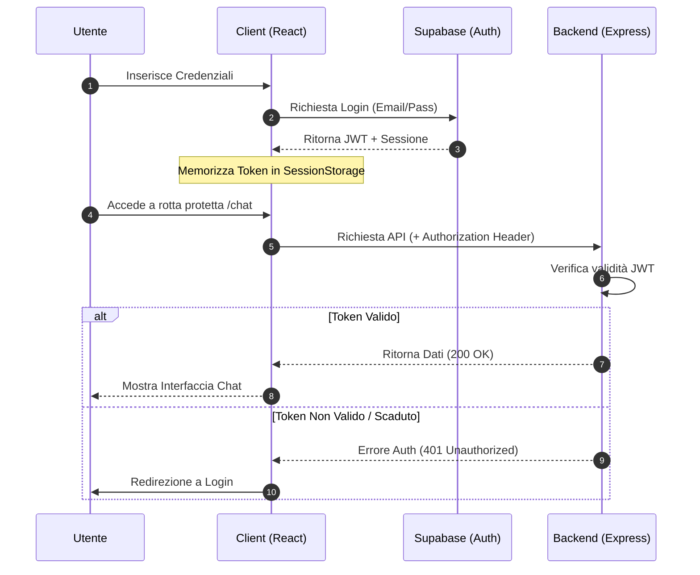


---


# 04 - Chat e Interazione con LLM

Il modulo di chat consente di interagire con decine di modelli diversi — OpenAI, Anthropic, Google Gemini, Meta Llama — attraverso un'unica interfaccia unificata: **OpenRouter**.

---

## 4.1 Architettura della Chat

Il sistema è strutturato secondo un modello a **Gateway**, pensato per garantire sicurezza e flessibilità:

1. **Frontend (React)**: Gestisce lo stato della conversazione, il rendering del Markdown e la selezione dinamica del modello da parte dell'utente.
2. **Backend (Express)**: Agisce da intermediario sicuro (proxy). Le chiavi API non vengono mai esposte al client: il server riceve la richiesta, verifica l'autenticazione e inoltra la chiamata ai provider.
3. **OpenRouter**: Funziona da aggregatore universale, offrendo un'unica implementazione per parlare con modelli che avrebbero altrimenti API differenti tra loro.

---

## 4.2 Caratteristiche Tecniche

### 1. Risposta in Streaming (SSE)

Per migliorare l'esperienza utente, la chat sfrutta i **Server-Sent Events (SSE)**. Invece di attendere che il modello generi l'intera risposta — operazione che può richiedere diversi secondi — il testo viene visualizzato parola per parola nel momento stesso in cui viene prodotto, esattamente come si vede su ChatGPT o Claude.

### 2. Selezione Dinamica del Modello

Tramite un servizio di recupero metadati (`getModels`), l'utente può scegliere il modello più adatto al proprio compito:

- **Modelli Veloci**: Ideali per correzioni grammaticali o risposte rapide (es. GPT-5.5).
- **Modelli Potenti**: Ottimali per programmazione o analisi complessa (es. Claude Opus 4.7).
- **Modelli di Ragionamento**: Pensati per problemi logico-matematici (es. Gemini 3.1 Pro).

### 3. Gestione del Reasoning Effort

I modelli di nuova generazione supportano un meccanismo di "ragionamento interno" prima di rispondere. Il sistema espone il parametro `reasoning_effort`, che permette di regolare quanto tempo il modello dedica a "pensare" prima di produrre l'output, trovando il giusto equilibrio tra precisione e velocità di risposta.

---

## 4.3 Flusso di Comunicazione (UML)

Il diagramma illustra il percorso di un messaggio, dalla digitazione dell'utente fino alla ricezione della risposta in streaming.

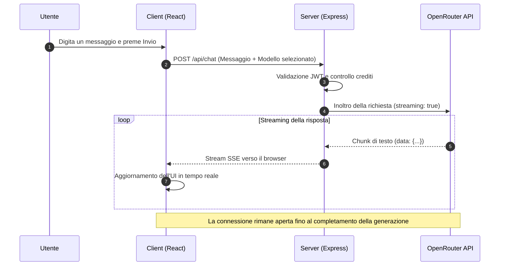

---

## 4.4 Vantaggi dell'Approccio Centralizzato

- **Ridondanza**: Se un provider è temporaneamente non disponibile (es. OpenAI), l'utente può passare immediatamente a un altro (es. Anthropic), senza interruzioni.
- **Ottimizzazione dei Costi**: È possibile scegliere modelli più economici per task semplici, riservando quelli più potenti — e costosi — alle operazioni che lo richiedono davvero.
- **Facilità di Aggiornamento**: L'aggiunta di un nuovo modello sul mercato non richiede alcuna modifica al codice del frontend.


---


# 05 - Gestione della Persistenza

Perché una conversazione con un'IA sia utile, è fondamentale che il sistema ricordi i messaggi precedenti. In **SmartAI** questa funzionalità è gestita da un sistema di persistenza basato su **Supabase (PostgreSQL)**, che consente all'utente di riprendere le proprie chat da qualsiasi dispositivo in qualsiasi momento.

---

## 5.1 Il Modello dei Dati

La struttura del database è pensata per gestire conversazioni multiple per ogni utente, preservando l'ordine cronologico dei messaggi.

### Entità Principali

1. **Conversations**: Contiene i metadati della chat — titolo, ID utente, data di creazione e modello AI preferito.
2. **Messages**: Contiene i singoli scambi — ruolo (`user` o `assistant`), contenuto, timestamp e riferimento alla conversazione di appartenenza.

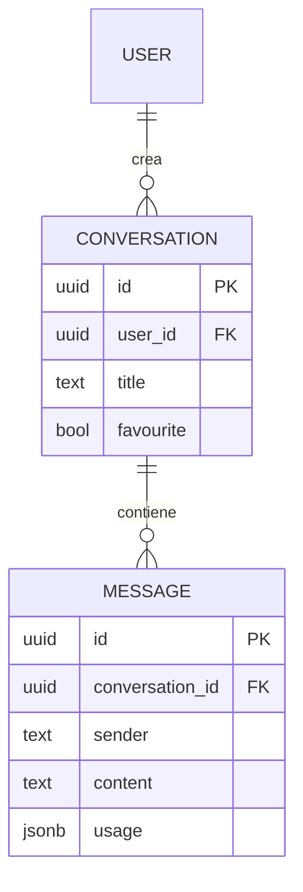
---

## 5.2 Operazioni CRUD sulla Chat

Il sistema implementa tutte le operazioni fondamentali per la gestione del ciclo di vita di una conversazione:

- **Creazione**: Al primo messaggio inviato, viene creata una nuova conversazione. Il titolo viene impostato inizialmente come "Nuova Chat" e potrà essere aggiornato in seguito.
- **Recupero (Listing)**: La sidebar interroga il database per mostrare la cronologia delle chat dell'utente, ordinate per data di creazione.
- **Rinomina**: L'utente può assegnare un nome personalizzato a ogni conversazione per organizzarle. In futuro è prevista la generazione automatica del titolo tramite IA, basata sul contenuto della chat.
- **Eliminazione**: La rimozione di una conversazione sfrutta il vincolo `ON DELETE CASCADE`, che cancella automaticamente tutti i messaggi associati, garantendo la coerenza dei dati.

---

## 5.3 Gestione del Contesto con la Sliding Window

I modelli di linguaggio hanno un limite nel numero di token che possono elaborare in una singola richiesta. Per questo motivo, il sistema non invia mai l'intera storia della conversazione, ma adotta una strategia di **Sliding Window**:

1. Vengono recuperati dal database solo gli ultimi *N* messaggi. Quelli più vecchi vengono compressi in un unico messaggio di riepilogo, in modo da mantenere il filo della conversazione senza sovraccaricare il modello.
2. I messaggi vengono formattati in un array JSON comprensibile dall'IA.
3. A ogni richiesta viene anteposto un **System Prompt** che definisce il comportamento e il tono dell'assistente.

Questa tecnica garantisce che il modello abbia sempre accesso ai riferimenti più recenti della conversazione, senza mai superare i limiti tecnici imposti dai provider.

---

## 5.4 Integrazione Frontend-Backend

Le chiamate al database avvengono tramite il client Supabase integrato nell'applicazione, con tempi di risposta ridotti grazie all'indicizzazione nativa di PostgreSQL. Il salvataggio è asincrono: non appena lo streaming della risposta dell'IA si conclude, il contenuto viene persistito nel database, pronto per essere recuperato alla sessione successiva.


---


# 06 - RAG e Vector Search: Il Cuore della Conoscenza

Il **RAG (Retrieval Augmented Generation)** è la funzionalità che consente a SmartAI di interrogare documenti PDF complessi restituendo risposte precise e ancorate al testo, evitando il fenomeno delle "allucinazioni" — risposte plausibili ma inventate, del tutto scollegate dal materiale fornito.

---

## 6.1 Fondamenti e Vantaggi del RAG

Il sistema RAG funziona come un assistente che consulta un manuale prima di rispondere, invece di affidarsi esclusivamente alla memoria. I vantaggi principali sono:

- **Conoscenza Verticale**: Il sistema acquisisce informazioni che il modello base non conosce, come appunti privati, tesine, report aziendali o qualsiasi documento personale.
- **Riduzione delle Allucinazioni**: Poiché il modello è istruito a rispondere *solo* citando il testo fornito, il rischio di risposte inventate si riduce drasticamente.
- **Memoria Praticamemte Illimitata**: Invece di caricare centinaia di pagine nel prompt, il sistema salva i contenuti nel database e recupera solo i frammenti pertinenti al momento della domanda.

---

## 6.2 La Strategia di Chunking Ricorsivo

Per consentire all'IA di elaborare un documento di 100 pagine, non è possibile inviarlo interamente in una sola volta. Il testo viene suddiviso in frammenti chiamati **chunk**, seguendo questa pipeline:

1. **Normalizzazione**: Pulizia del testo con rimozione di caratteri di controllo e normalizzazione Unicode (NFC).
2. **Heading Detection**: Il sistema identifica i titoli delle sezioni (es. "Capitolo 1", "1.2 Obiettivi") per preservare la struttura gerarchica del documento.
3. **Split Multilivello**:
   - Si parte dai **paragrafi** (doppio newline).
   - Se un paragrafo supera la dimensione massima, si scende alle **frasi**.
   - Se necessario, si arriva alle **singole parole**.
4. **Overlap (Sovrapposizione)**: Ogni chunk mantiene circa 300 caratteri del frammento precedente, in modo da non perdere il contesto semantico tra la fine di un pezzo e l'inizio del successivo.

---

## 6.3 Il Concetto di Spazio Vettoriale (Embedding)

Ogni frammento di testo viene trasformato in un insieme di coordinate numeriche chiamato **vettore** o **embedding**. Si può immaginare una mappa multidimensionale dove i concetti semanticamente simili si trovano geograficamente vicini. Per questa trasformazione viene utilizzato il modello `text-embedding-3-small`, che produce vettori da **1536 dimensioni**.

---

## 6.4 Meccanismo Matematico: La Similarità del Coseno

Per stabilire quanto due concetti siano semanticamente vicini, il sistema utilizza la **Similarità del Coseno**: misura l'angolo formato tra il vettore della domanda dell'utente e i vettori dei frammenti salvati nel database.

$$
\text{Similarity} = \cos(\theta) = \frac{\mathbf{A} \cdot \mathbf{B}}{\|\mathbf{A}\| \|\mathbf{B}\|}
$$

I valori si interpretano così:

- **1.0** → Significato identico.
- **0.4** → Soglia minima di pertinenza adottata nel progetto.
- **0.0** → Nessuna correlazione semantica.

---

## 6.5 Ottimizzazione: La Funzione RPC su PostgreSQL

Per gestire migliaia di frammenti in pochi millisecondi, è stata implementata una funzione **RPC (Remote Procedure Call)** direttamente in PostgreSQL su Supabase, sfruttando l'estensione `pgvector`:

```sql
CREATE OR REPLACE FUNCTION match_documents (
  query_embedding vector(1536),
  match_threshold float,
  match_count int,
  filter_user_id uuid,
  selected_id uuid
)
RETURNS TABLE (
  id uuid,
  content text,
  similarity float,
  metadata jsonb
)
LANGUAGE plpgsql
AS $$
BEGIN
  RETURN QUERY
  SELECT
    documents.id,
    documents.content,
    1 - (documents.embedding <=> query_embedding) AS similarity,
    documents.metadata
  FROM documents
  WHERE documents.user_id = filter_user_id
    AND documents.document_id = selected_id
    AND 1 - (documents.embedding <=> query_embedding) > match_threshold
  ORDER BY documents.embedding <=> query_embedding
  LIMIT match_count;
END;
$$;
```

L'operatore `<=>` calcola la distanza coseno tra vettori: i risultati vengono ordinati per rilevanza e restituiti solo se superano la soglia minima impostata.

---

## 6.6 Flusso RAG: Dal PDF alla Risposta

Di seguito è illustrato il percorso completo dei dati, dal caricamento del documento fino alla risposta generata dall'IA.

<div style="font-family: 'Segoe UI', Tahoma, Geneva, Verdana, sans-serif; padding: 20px; background: #0f172a; border-radius: 15px; color: white;">
    <div style="display: flex; flex-direction: column; gap: 20px;">
        <div style="display: flex; align-items: center; gap: 15px;">
            <div style="background: #3b82f6; width: 40px; height: 40px; border-radius: 50%; display: flex; align-items: center; justify-content: center; font-weight: bold; flex-shrink: 0;">1</div>
            <div style="background: rgba(255,255,255,0.05); padding: 15px; border-radius: 10px; flex-grow: 1; border: 1px solid rgba(59,130,246,0.3);">
                <strong style="color: #60a5fa;">Ingestione PDF</strong><br>
                L'utente carica il documento. Il server estrae il testo grezzo con <code>pdf-parse</code>.
            </div>
        </div>
        <div style="margin-left: 20px; border-left: 2px dashed #334155; height: 20px;"></div>
        <div style="display: flex; align-items: center; gap: 15px;">
            <div style="background: #10b981; width: 40px; height: 40px; border-radius: 50%; display: flex; align-items: center; justify-content: center; font-weight: bold; flex-shrink: 0;">2</div>
            <div style="background: rgba(255,255,255,0.05); padding: 15px; border-radius: 10px; flex-grow: 1; border: 1px solid rgba(16,185,129,0.3);">
                <strong style="color: #34d399;">Recursive Chunking</strong><br>
                Il testo viene suddiviso in frammenti da 1500 caratteri con 300 di overlap, preservando titoli e struttura delle frasi.
            </div>
        </div>
        <div style="margin-left: 20px; border-left: 2px dashed #334155; height: 20px;"></div>
        <div style="display: flex; align-items: center; gap: 15px;">
            <div style="background: #f59e0b; width: 40px; height: 40px; border-radius: 50%; display: flex; align-items: center; justify-content: center; font-weight: bold; flex-shrink: 0;">3</div>
            <div style="background: rgba(255,255,255,0.05); padding: 15px; border-radius: 10px; flex-grow: 1; border: 1px solid rgba(245,158,11,0.3);">
                <strong style="color: #fbbf24;">Vectorization & Storage</strong><br>
                Ogni chunk viene convertito in un vettore numerico e salvato su Supabase tramite pgvector.
            </div>
        </div>
        <div style="margin-left: 20px; border-left: 2px dashed #334155; height: 20px;"></div>
        <div style="display: flex; align-items: center; gap: 15px;">
            <div style="background: #ef4444; width: 40px; height: 40px; border-radius: 50%; display: flex; align-items: center; justify-content: center; font-weight: bold; flex-shrink: 0;">4</div>
            <div style="background: rgba(255,255,255,0.05); padding: 15px; border-radius: 10px; flex-grow: 1; border: 1px solid rgba(239,68,68,0.3);">
                <strong style="color: #f87171;">Semantic Retrieval</strong><br>
                Alla domanda dell'utente, la funzione RPC individua i 7 frammenti più pertinenti tramite similarità del coseno.
            </div>
        </div>
        <div style="margin-left: 20px; border-left: 2px dashed #334155; height: 20px;"></div>
        <div style="display: flex; align-items: center; gap: 15px;">
            <div style="background: #8b5cf6; width: 40px; height: 40px; border-radius: 50%; display: flex; align-items: center; justify-content: center; font-weight: bold; flex-shrink: 0;">5</div>
            <div style="background: rgba(255,255,255,0.05); padding: 15px; border-radius: 10px; flex-grow: 1; border: 1px solid rgba(139,92,246,0.3);">
                <strong style="color: #a78bfa;">Augmented Response</strong><br>
                L'IA riceve i frammenti recuperati e costruisce la risposta citando direttamente le fonti, garantendo precisione e tracciabilità.
            </div>
        </div>
    </div>
</div>


---


# 07 - Generative UI: L'Interfaccia che Prende Forma

Uno dei limiti storici dei chatbot è la loro natura puramente testuale. In **SmartAI**, abbiamo superato questo vincolo implementando la **Generative UI**: un sistema che permette all'intelligenza artificiale di "decidere" non solo cosa dire, ma anche come mostrarlo, generando componenti grafici interattivi in tempo reale.

---

## 7.1 Il Protocollo di Comunicazione

Il segreto della Generative UI risiede in un protocollo di messaggistica ibrido. L'AI risponde in Markdown standard, ma quando deve mostrare dati strutturati, inserisce dei tag XML-like nel flusso di testo:

```xml
Ecco un riepilogo delle tue spese:

<ui-component type="dynamic">
  {
    "root": {
      "type": "container",
      "props": { "direction": "row", "gap": 4 },
      "children": [
        { "type": "metric", "props": { "label": "Totale", "value": "€1.240", "trend": "+12%" } },
        { "type": "progress", "props": { "label": "Budget", "value": 80, "max": 100, "color": "emerald" } }
      ]
    }
  }
</ui-component>
```

Il client intercetta questi tag tramite un **Parser RegEx** avanzato (`parseGenerativeUI.ts`) e divide il messaggio in "chunk" di testo e "chunk" di componenti React.

---

## 7.2 L'Architettura del Renderer

Il componente `GenerativeUIRenderer` funge da orchestratore. Riceve la stringa grezza dall'AI e coordina il rendering:

1.  **Parsing**: Divide il testo dai componenti.
2.  **Lookup**: Consulta il `COMPONENT_REGISTRY` per trovare il componente React corrispondente al `type`.
3.  **Injection**: Passa il payload JSON come `data` al componente.
4.  **Fallback**: Se il JSON è malformato (accade spesso durante lo streaming), il sistema renderizza il testo grezzo per evitare la perdita di informazioni.

---

## 7.3 I Due Pilastri: Dynamic Canvas e Sandbox

Abbiamo sviluppato due approcci complementari per la generazione della UI:

### A. Dynamic Canvas (Low-Code Architecture)
È un sistema di componenti atomici pre-definiti (Text, Metric, Progress, Icon, Container). 
- **Vantaggio**: Coerenza estetica assoluta con il design system dell'app.
- **Sicurezza**: L'AI non scrive codice eseguibile, ma compone una struttura dati sicura.
- **Performance**: Estremamente leggero e veloce da renderizzare.

### B. Sandbox (High-Code Architecture)
Quando la complessità lo richiede (es. grafici complessi con Chart.js o D3), l'AI può generare un intero blocco di codice HTML, CSS e JavaScript.
- **Isolamento**: Il codice gira all'interno di un `<iframe>` con l'attributo `sandbox="allow-scripts"`.
- **Librerie Auto-iniettate**: La Sandbox include automaticamente TailwindCSS, Chart.js e D3 per permettere visualizzazioni professionali senza sforzo.
- **Resizing Dinamico**: Un `ResizeObserver` comunica al client l'altezza esatta del contenuto per evitare barre di scorrimento antiestetiche.

---

## 7.4 Flusso di Generazione (UML)

Il seguente diagramma descrive il viaggio di un componente dalla mente dell'AI allo schermo dell'utente.

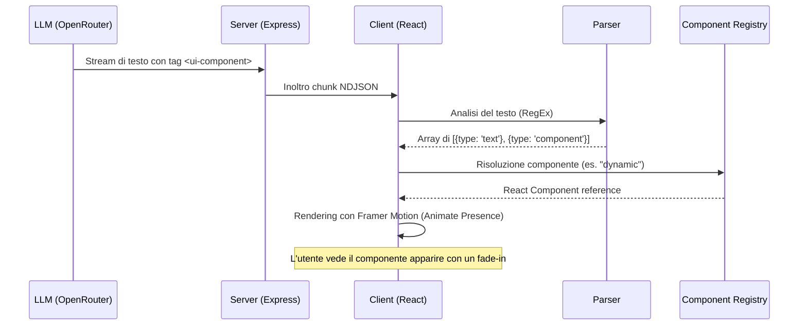

---

## 7.5 Sfide Tecniche e Ottimizzazioni

*   **Streaming Content**: Durante la generazione, il tag XML è incompleto. Il parser è istruito per ignorare i tag aperti fino a quando non sono chiusi o validi, garantendo che l'interfaccia non "salti" durante la digitazione.
*   **Memoizzazione**: Usiamo `React.memo` intensivamente sui renderer per evitare ricaricamenti costosi dell'iframe Sandbox ogni volta che arriva un nuovo token di testo.
*   **Design Tokens**: Il `DynamicCanvas` mappa i nomi dei colori dell'AI (es. "emerald") su classi Tailwind specifiche, mantenendo l'armonia cromatica con la Dark Mode dell'applicazione.


---


# 08 - Integrazione Calendario: AI Agents

Con un semplice messaggio, l’AI può leggere il calendario, creare eventi, modificarli o eliminarli grazie all’integrazione con Google Calendar.

---

## 8.1 Che cos’è un AI Agent?

Un chatbot classico si limita a generare testo. Un **AI Agent**, invece, può anche eseguire azioni per raggiungere un obiettivo.

Ad esempio, se un utente chiede: *"Quando sono libero domani?"*, un chatbot normale potrebbe solo suggerire di controllare il calendario. Un AI Agent, invece, può leggere gli eventi presenti, trovare gli orari liberi e persino creare un appuntamento.

### I 4 passaggi principali

Per far funzionare correttamente l’agente sono necessari quattro elementi:

1. **Contesto**
   
   L’agente riceve il messaggio dell’utente insieme a informazioni importanti come data, ora e fuso orario. In questo modo riesce a capire richieste come *"sposta a domani"* oppure *"fissa per venerdì sera"*.

2. **Ragionamento**
   
   Il modello analizza la richiesta e decide cosa fare. Se l’utente scrive *"Sposta la riunione con Marco a mercoledì"*, l’agente capisce che deve prima cercare l’evento e poi modificarlo.

3. **Scelta degli strumenti**
   
   L’AI seleziona la funzione più adatta tra quelle disponibili, ad esempio:
   
   - `list_events`
   - `create_event`
   - `update_event`
   - `delete_event`

4. **Esecuzione**
   
   Il server esegue la richiesta tramite le API di Google Calendar e restituisce il risultato all’AI, che genera poi la risposta finale per l’utente.

---

## 8.2 Flusso di lavoro

Il funzionamento dell’integrazione si basa su un ciclo continuo tra server e modello AI. Il diagramma seguente mostra cosa succede quando un utente usa la chat del calendario.

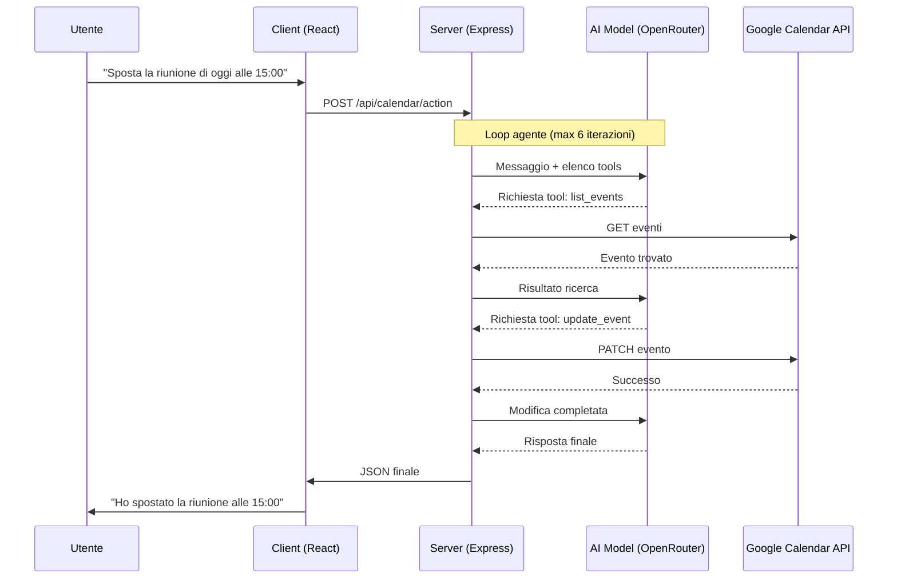

---

## 8.3 Implementazione Tecnica e "Function Calling"

La parte più importante dell’integrazione è il Function Calling, cioè il sistema che permette all’AI di usare funzioni reali del server.
### Come l'AI "usa" il codice
Abbiamo definito per l'AI uno schema JSON che descrive cosa può fare. Per esempio:
*   **Nome**: `create_event`
*   **Descrizione**: "Crea un nuovo impegno sul calendario."
*   **Parametri**: Titolo, Descrizione, Data Inizio, Data Fine.

Quando l’utente invia un messaggio, il modello non esegue direttamente il codice. Restituisce invece una richiesta strutturata che indica quale funzione usare e con quali dati.

Il server Express riceve la richiesta ed esegue la vera chiamata alle API di Google Calendar usando il token OAuth2 dell’utente.
### L'Assistente "Floating"
L'interfaccia utente è stata progettata per non essere invasiva. Una **Floating Chat** (chat fluttuante) o in modalità sidebar permette all'utente di interagire con l'AI mentre consulta i propri impegni. L'utente può anche cambiare modello al volo (es. passare a un modello più veloce o uno più intelligente), e interagire con il calendario mentre lo guarda, vedendo gli eventi apparire o spostarsi in tempo reale grazie alla reattività di React.

---


Invece di navigare tra menu, selezionare orari e scrivere titoli, l'utente esprime un desiderio ("Organizza una cena con amici venerdì sera") e l'AI si occupa della logica: controlla la disponibilità, formatta i dati secondo gli standard ISO 8601 e comunica con i server di Google. Questo rappresenta il futuro della produttività: meno "clic", più conversazione.


---


# 09 - Strumenti di Apprendimento: Mindmap, Quiz, Flashcard e Diagrammi

Questo capitolo esplora la dimensione educativa di SmartAI, analizzando come l'architettura del sistema supporti metodi pedagogici moderni come l'**Apprendimento Costruttivista**. In questa visione, l'utente non è un fruitore passivo di contenuti, ma un partecipante attivo che costruisce la propria conoscenza interagendo con strumenti dinamici. SmartAI facilita questo processo riducendo il carico cognitivo e stimolando il pensiero critico.

---

## 9.1 Mappe Mentali e Strutturazione della Conoscenza

Secondo la teoria della doppia codifica di Paivio, l'informazione viene elaborata e memorizzata meglio quando è presentata contemporaneamente in formato verbale e visuale. Le mappe mentali sono il pilastro della visualizzazione concettuale in SmartAI: a differenza di una lettura lineare, permettono di cogliere immediatamente le relazioni gerarchiche e spaziali tra i concetti.

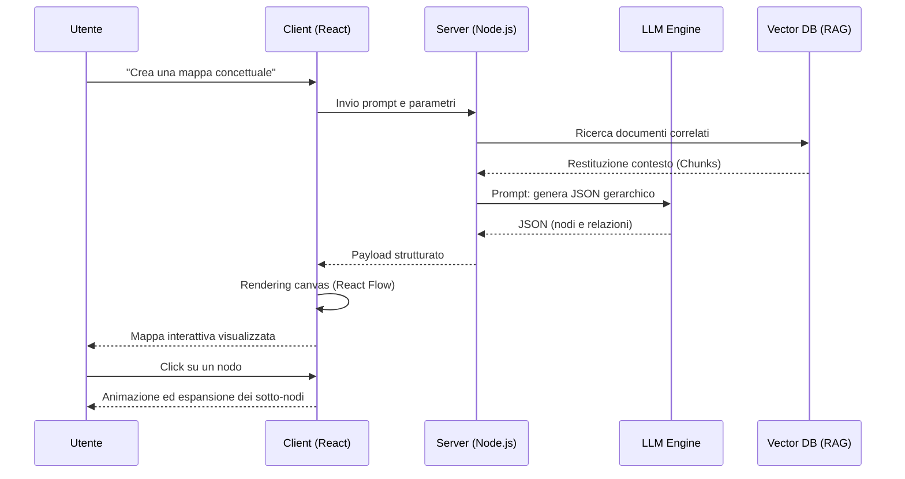

---

## 9.2 Quiz Interattivi e Valutazione Formativa

Il modulo Quiz implementa la **Valutazione Formativa**: una valutazione continua che avviene durante il processo di apprendimento, pensata per identificare lacune in tempo reale, non per assegnare un voto finale.

### Tipologie di Domande e Feedback Adattivo

L'IA genera domande di tre tipologie:

- **Scelta Multipla**: per testare il riconoscimento di fatti e definizioni.
- **Vero/Falso**: per verificare la comprensione di concetti fondamentali.
- **Domande di Ragionamento**: in cui l'utente deve collegare due concetti tra loro.

Il feedback non si limita a "Corretto" o "Errato". SmartAI genera una **spiegazione contestuale** che chiarisce il perché una risposta sia sbagliata, citando direttamente i documenti caricati dall'utente tramite il sistema RAG.

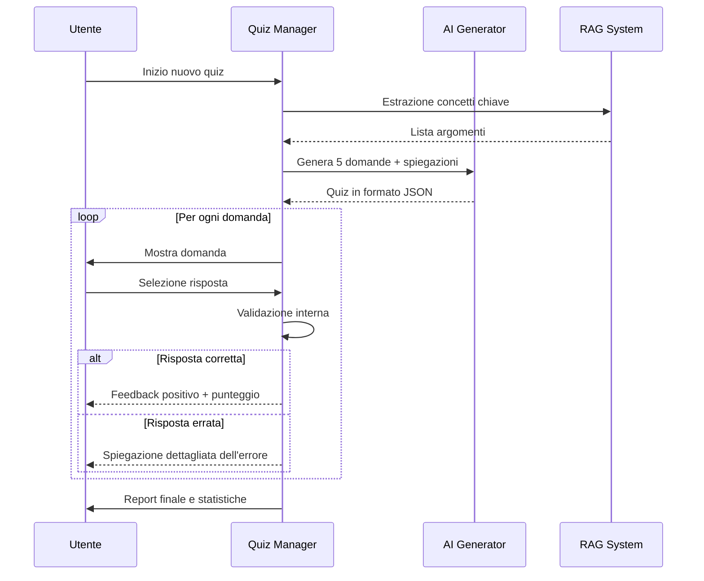

---

## 9.3 Flashcard e Ripetizione Spaziata (SRS)

Le Flashcard di SmartAI si basano sul **Sistema Leitner**, una tecnica di studio che ottimizza il tempo di ripasso concentrandosi sui concetti più difficili da ricordare.

### Integrazione Algoritmica

Ogni interazione con una flashcard aggiorna i metadati della carta nel database:

- **Ease Factor**: Un moltiplicatore che determina l'intervallo di tempo prima del prossimo ripasso.
- **Interval**: Il numero di giorni tra una sessione di ripasso e la successiva.

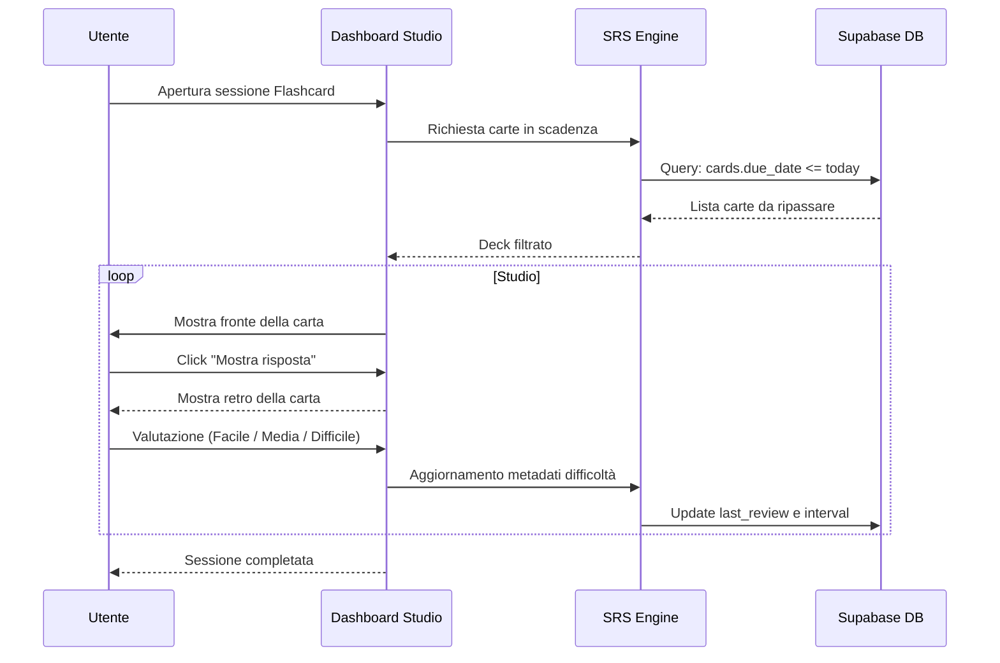

---

## 9.4 Generazione e Rendering di Diagrammi UML

In ambito tecnico, saper visualizzare strutture logiche è essenziale. SmartAI funge da **traduttore semantico-grafico**: l'utente descrive un sistema in linguaggio naturale e il modello genera il diagramma corrispondente in sintassi Mermaid.js — diagrammi di classe, di flusso o di sequenza — con rendering in tempo reale.

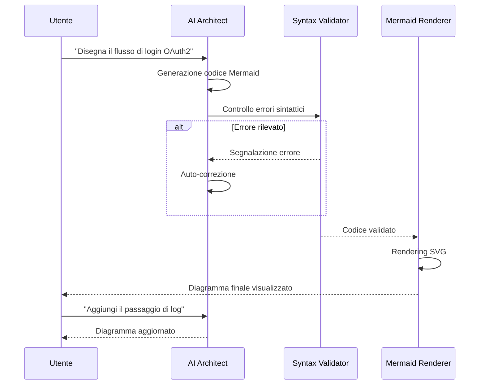

---

## 9.5 Impatto Didattico

L'integrazione di questi strumenti trasforma il rapporto tra studente e intelligenza artificiale. Non si tratta più di chiedere la risposta, ma di usare l'IA per costruire impalcature cognitive (**scaffolding**): strutture di supporto che rendono accessibili anche gli argomenti più complessi.

I vantaggi principali dell'approccio multimodale adottato sono:

1. **Personalizzazione Massima**: Tutti gli esercizi sono generati a partire dai propri appunti e documenti.
2. **Riduzione dell'Ansia da Studio**: Suddividere argomenti complessi in mappe e schemi rende il lavoro più gestibile e meno intimidatorio.
3. **Versatilità**: Gli strumenti si adattano a qualsiasi materia, dalla storia alla programmazione.

SmartAI si posiziona così non come un semplice generatore di risposte, ma come un catalizzatore tecnologico che rende accessibili metodi di apprendimento scientificamente fondati.


---


# 10 - Supporto e Manutenibilità

Un sistema complesso come SmartAI non deve solo offrire buone funzionalità, ma anche essere facile da controllare e da supportare.

---

## 10.1 Logging centralizzato

Per tenere sotto controllo il sistema, è stato creato un sistema di logging su due livelli: uno per il server e uno per il client.

### A. Logging del server

Nel backend è stato aggiunto un middleware personalizzato (`httpLoggingMiddleware`) che intercetta ogni richiesta e risposta. Questo permette di:

- **Misurare le prestazioni**: viene salvata la durata in millisecondi di ogni chiamata API.
- **Tenere traccia delle operazioni**: ogni accesso a Supabase e ogni chiamata ai modelli AI viene registrata con data, ora e ID della richiesta.
- **Registrare i messaggi di console**: `console.log` e `console.error` sono stati modificati in modo che ogni messaggio venga salvato anche in un buffer interno di audit, senza perdere il metodo originale.

### B. Remote logging del frontend

Gli errori che si verificano nel browser dell’utente non sono sempre visibili agli sviluppatori. Per questo è stato creato un **Remote Logger**:

- **Rilevamento dei crash**: se l’app React genera un errore non gestito o una Promise viene rifiutata, il client invia subito un report all’endpoint `/api/logs`.
- **Supporto in sviluppo**: durante la fase di sviluppo vengono intercettati anche alcuni errori legati a Vite e all’HMR.
- **Dati completi**: ogni log include stack trace, user agent, IP del client e URL della pagina in cui si è verificato il problema.

Tutti i log sono visibili solo agli amministratori. Nessun dato sensibile viene inviato a servizi esterni.

---

## 10.2 Gestione dei ticket

Il supporto utenti si basa su una tabella dedicata in Supabase (`support_tickets`) e segue questi passaggi:

1. **Creazione**: l’utente compila il form nella Help Page, scegliendo la categoria del problema e scrivendo il messaggio.
2. **Salvataggio**: il ticket viene inserito nel database con stato iniziale `open` e associato all’utente.
3. **Monitoraggio**: l’utente può controllare in ogni momento lo storico dei propri ticket e vedere eventuali risposte degli amministratori.

> [!TODO]
> **Possibile sviluppo futuro**: SmartAI potrebbe analizzare automaticamente il contenuto del ticket con RAG e proporre una risposta iniziale basata sulla documentazione interna, così da ridurre i tempi di attesa.

---

## 10.3 Audit log e sicurezza

Per ogni operazione importante — come l’eliminazione di una conversazione, la modifica dei dati utente o l’accesso da parte di utenti sospetti — il sistema genera un **Audit Log**. Questi record servono a:

- **Sapere chi ha fatto cosa** e in quale momento.
- **Ricostruire eventuali problemi** in caso di errore.
- **Individuare attività anomale** o tentativi di accesso non autorizzati.

---

## 10.4 Flusso di monitoraggio

Il diagramma mostra come un errore nel browser venga inviato al server e salvato nel sistema di monitoraggio.

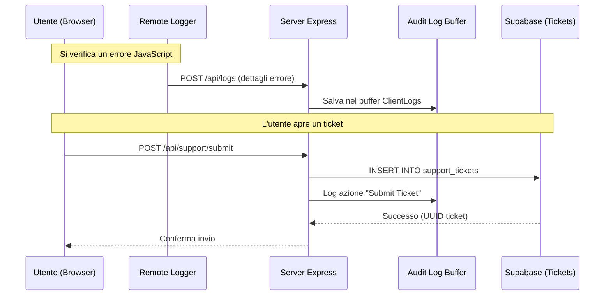
---

## 10.5 Politica di Retention dei Log

Per evitare di saturare la memoria, il sistema adotta una politica di rotazione automatica:

- **Audit Log Server**: Vengono conservati gli ultimi 500 eventi HTTP e di sistema.
- **Client Log**: Vengono conservati gli ultimi 100 report di crash provenienti dal frontend.
- **Persistenza Selettiva**: solo i ticket di supporto vengono salvati in modo permanente nel database. I log tecnici restano temporanei per mantenere buone prestazioni, ma i limiti possono essere cambiati in qualsiasi momento.


---


# 11 - Infrastruttura e Database

Di seguito è riportata la struttura del database di SmartAI.

---

## 11.1 Tabella `profiles`

Questa tabella collega il sistema di autenticazione ai dati dell’utente.

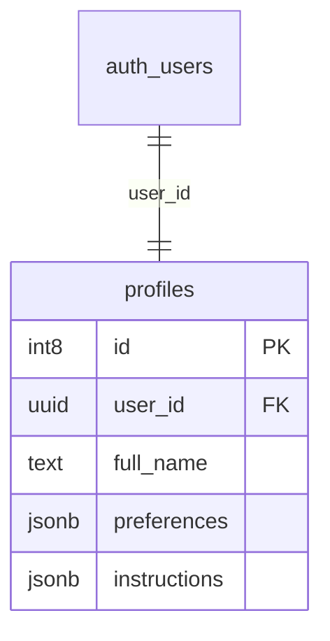

### Campi principali

* **`user_id` (UUID)**: collega il profilo alla tabella `auth.users`.
* **`subscription_level` (int2)**: salva il livello di abbonamento dell’utente.
* **`instructions` (jsonb)**: contiene le istruzioni personalizzate usate dall’AI.

Il formato JSONB permette di salvare dati con struttura variabile senza modificare continuamente il database.

---

## 11.2 Tabella `conversations`

Gestisce le conversazioni create dagli utenti.

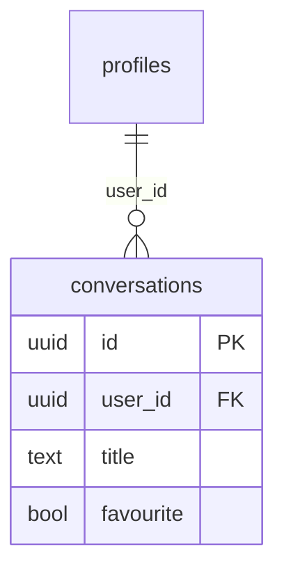

### Campi principali

* **`id` (UUID)**: identificatore unico della conversazione.
* **`favourite` (bool)**: permette di salvare le chat importanti.
* **`updated_at` (timestamptz)**: usato per ordinare le conversazioni in base all’ultima modifica.

---

## 11.3 Tabella `messages`

Contiene tutti i messaggi delle chat.

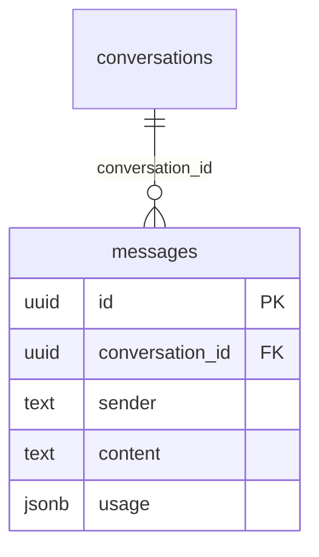

### Campi principali

* **`sender` (text)**: indica se il messaggio arriva dall’utente o dall’AI.
* **`content` (text)**: testo del messaggio.
* **`usage` (jsonb)**: salva informazioni sui token utilizzati dai modelli AI.
* **`reasoning_text` (text)**: contiene eventuali passaggi di ragionamento prodotti dal modello.

JSONB viene usato perché modelli diversi restituiscono dati differenti.

---

## 11.4 Tabella `documents`

Questa tabella viene usata dal sistema RAG per la memoria a lungo termine.

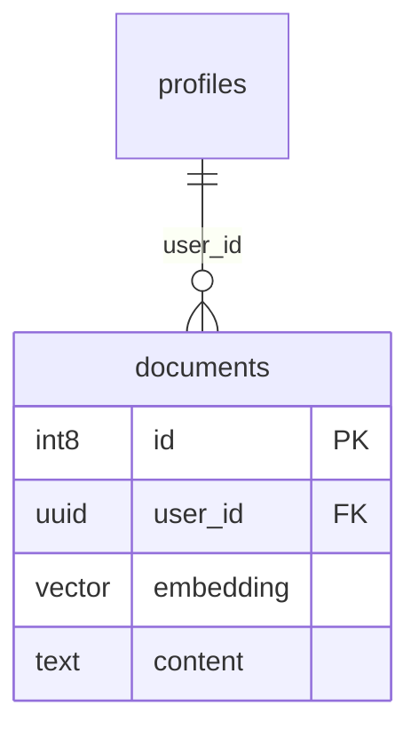

### Campi principali

* **`embedding` (vector)**: contiene la rappresentazione numerica del testo.
* **`content` (text)**: testo del documento.
* **`metadata` (jsonb)**: salva informazioni sul file originale, come nome e data.

Il tipo `vector` viene fornito da pgvector ed è necessario per la ricerca semantica.

---

## 11.5 Tabella `api_providers`

Permette agli utenti di usare chiavi API personali.

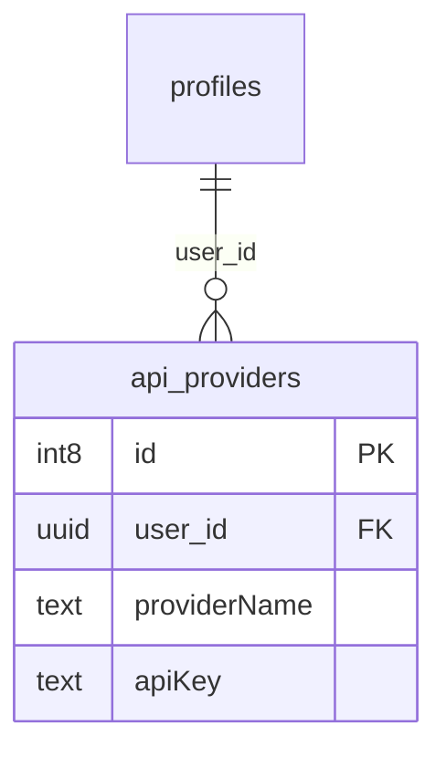

### Campi principali

* **`providerName` (text)**: nome del provider AI.
* **`apiKey` (text)**: chiave API dell’utente.

In un ambiente di produzione, le chiavi dovrebbero essere crittografate prima del salvataggio.

---

## 11.6 Tabella `support_tickets`

Gestisce il sistema di assistenza.

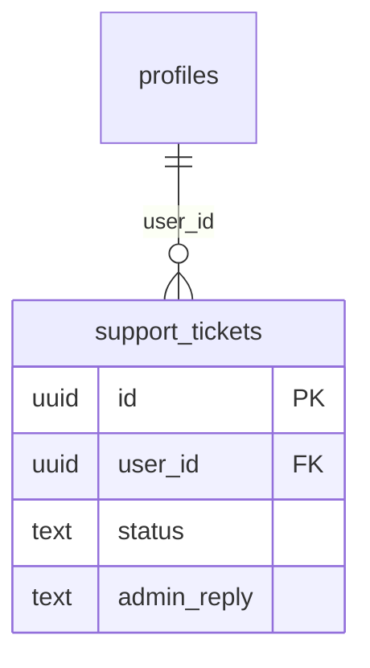

### Campi principali

* **`problem_type` (text)**: categoria del problema.
* **`status` (text)**: stato del ticket.
* **`admin_reply` (text)**: risposta dell’amministratore.

---

## 11.7 Scelta dei tipi di dato

#### UUID

Usato per le chiavi principali perché rende più difficile prevedere gli ID degli utenti e facilita la scalabilità.

#### JSONB

Permette di salvare dati con struttura variabile senza dover modificare continuamente le tabelle.

#### TIMESTAMPTZ

Serve per gestire correttamente date e orari anche tra utenti con fusi orari diversi.

#### VECTOR

Utilizzato per la ricerca semantica e per le funzionalità AI basate sugli embedding.


---


# 12 - Analisi delle performance e ottimizzazioni

Questo capitolo descrive le tecniche usate per rendere SmartAI veloce, fluido ed efficiente. In un sistema basato su AI, le performance non dipendono solo dal caricamento delle pagine, ma soprattutto dalla velocità con cui vengono generate le risposte e dal consumo di token.

---

## 12.1 Ottimizzazioni server-side

### 1. Streaming NDJSON

Le risposte generate dai modelli AI possono richiedere alcuni secondi. Per evitare che l’utente aspetti troppo tempo senza vedere nulla, SmartAI utilizza lo **streaming NDJSON**.

- Il server invia il testo poco alla volta, man mano che viene generato.
- L’utente vede subito comparire la risposta senza attendere il completamento totale.

Questo riduce molto il tempo percepito di attesa.

### 2. Caching dei prompt

Ogni richiesta inviata all’AI contiene istruzioni e cronologia della chat. Inviare sempre tutto il contesto aumenta costi e tempi di risposta.

Per migliorare le prestazioni viene usato il **prompt caching**:

- le parti statiche del prompt vengono salvate temporaneamente,
- il sistema evita di reinviarle a ogni richiesta,
- diminuiscono sia i token usati sia il tempo di elaborazione.

### 3. Ricerca semantica con pgvector

Per il sistema RAG, la ricerca nei documenti deve essere molto veloce.

Per questo vengono usati:

- **pgvector** per gli embeddings,
- indici **HNSW** per accelerare la ricerca vettoriale.

In questo modo il sistema trova informazioni nei documenti in pochi millisecondi.

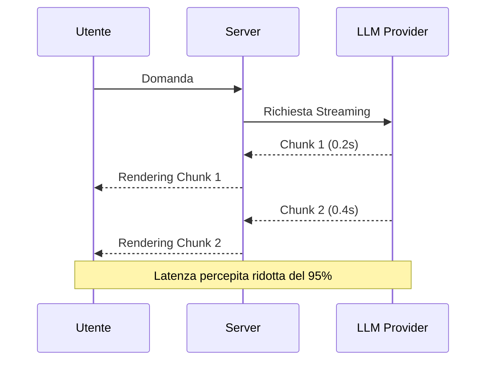

---

## 12.2 Ottimizzazioni Client-Side

### 1. Code Splitting e Lazy Loading
Per mantenere il bundle JavaScript leggero, SmartAI utilizza il **Code Splitting**.
- **Implementazione**: I componenti pesanti come le Mappe Mentali (Mermaid/React Flow) o i grafici dei Quiz vengono caricati solo quando necessari. 
- **Risultato**: Il caricamento iniziale della Dashboard è istantaneo, poiché il browser scarica solo il codice essenziale per la prima vista.

### 2. Optimistic UI Updates
Per operazioni come il salvataggio di una conversazione o l'aggiunta di un "preferito", SmartAI utilizza aggiornamenti ottimistici.
- **Logica**: La UI riflette il cambiamento *prima* che il server confermi l'operazione. Se la chiamata fallisce, lo stato viene ripristinato (rollback). Questo elimina la sensazione di ritardo dovuta alla latenza di rete.

### 3. Memoization e Pre-fetching
Utilizzo di `React.memo` e `useMemo` per prevenire re-render inutili di componenti complessi durante lo streaming dei messaggi. Inoltre, i dati delle chat passate vengono pre-fethcati in background quando l'utente passa il mouse sopra un titolo nella sidebar.

---

## 12.3 Efficienza dei Token e Cost Management

Il costo di un sistema AI è direttamente proporzionale al numero di token inviati e ricevuti. SmartAI adotta diverse tattiche per massimizzare il valore di ogni interazione:

1.  **Context Pruning**: Invece di inviare tutta la cronologia, il sistema invia solo gli ultimi $N$ messaggi rilevanti, riassumendo quelli più vecchi per mantenere il filo conduttore senza saturare la finestra di contesto.
2.  **Schema Enforcement**: Richiedendo all'AI di rispondere in formati strutturati (JSON), si riduce la verbosità inutile delle risposte ("Ecco il tuo quiz...", "Certo, ecco la mappa..."), risparmiando token di output.
3.  **Model Routing**: 
Si può decidere di usare modelli diversi a seconda della complessità della richiesta. Ad esempio si può usare Claude Opus 4.7 per task molto complesse e invece Gemini 3 Flash per task più semplici.
## 12.4 Tabella Comparativa delle Performance

| Metrica              | Senza ottimizzazione | Con ottimizzazioni | Miglioramento |
| :------------------- | :------------------- | :----------------- | :------------ |
| TTFT (primo token)   | 2500ms - 5000ms      | 150ms - 300ms      | ~94%          |
| Ricerca RAG          | 1200ms               | 45ms               | ~96%          |
| Bundle iniziale      | 1.8 MB               | 450 KB             | ~75%          |
| Costo medio per chat | $0.12                | $0.02              | ~75%          |

Le ottimizzazioni adottate permettono a SmartAI di essere non solo potente, ma anche veloce e piacevole da usare.

L’obiettivo principale è ridurre tempi di attesa, consumi e caricamenti inutili, migliorando l’esperienza dell’utente durante l’uso quotidiano.


---


# 13 - Conclusioni e Scalabilità

Il bilancio finale. Cosa ho imparato, quali ostacoli ho superato e, soprattutto, dove potrebbe arrivare SmartAI domani — perché ogni buon progetto non finisce mai davvero con la consegna.

TODO: aggiungere riflessioni personali e sviluppi futuri.